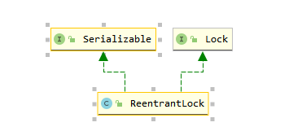
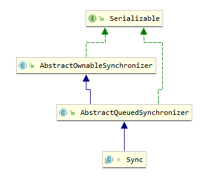

java.util.concurrent（简称JUC），在此封装了并发编程的常用工具类

## Atomic

子包atomic封装了原子类，如AtomicInteger、AtomicBoolean等，原理是利用底层的unsafe类的CAS方法去执行，是一种乐观锁设计思想

### 分为4类：

1、基本类型

​	AtomicInteger、AtomicLong、AtomicBoolean 

2、数组类型

​	更新数组里的某个元素

​	AtomicIntegerArray、AtomicLongArray、AtomicReferenceArray 

3、引用类型

​	AtomicReference、AtomicReferenceFieldUpdater、AtomicMarkableReference 

4、对象的属性修改类型

- AtomicIntegerFieldUpdater:原子更新整型字段的更新器
- AtomicLongFieldUpdater：原子更新长整型字段的更新器
- AtomicStampedReference ：原子更新带有版本号的引用类型。该类将整数值与引用关联起来，可用于解决原子的更新数据和数据的版本号，可以解决使用 CAS 进行原子更新时可能出现的 ABA 问题。
- AtomicMarkableReference：原子更新带有标记的引用类型。该类将 boolean 标记与引用关联起来，也可以解决使用 CAS 进行原子更新时可能出现的 ABA 问题。

### ABA问题及解决方式

描述: 第一个线程取到了变量 x 的值 A，然后巴拉巴拉干别的事，总之就是只拿到了变量 x 的值 A。这段时间内第二个线程也取到了变量 x 的值 A，然后把变量 x 的值改为 B，然后巴拉巴拉干别的事，最后又把变量 x 的值变为 A （相当于还原了）。在这之后第一个线程终于进行了变量 x 的操作，但是此时变量 x 的值还是 A，所以 compareAndSet 操作是成功

## 锁

子包locks封装了并发编程常用的锁，重点需要知道的是AbstractQueuedSynchronizer、ReentrantLock

### AQS

AQS是AbstractQueuedSynchronizer的简称，抽象队列同步器，它有一个内部类Node，是对一个节点的定义，Node有几个重要的属性，

```java
static final class Node {
	/**
	 *表示节点的状态。其中包含的状态有：
	 *1. CANCELLED，值为1，表示当前的线程被取消；
	 *2. SIGNAL，值为-1，表示当前节点的后继节点包含的线程需要 运行，也就是unpark；
	 *3. CONDITION，值为-2，表示当前节点在等待condition，也就是在condition队列中；
	 *4. PROPAGATE，值为-3，表示当前场景下后续的acquireShared能够得以执行；
	 *5. 值为0，表示当前节点在sync队列中，等待着获取锁。
	*/
	volatile int waitStatus；
	volatile Node prev; //上一个节点
	volatile Node next; //下一个节点
    Node nextWaiter; //存储condition队列中的后继节点
    Thread thread; //如队列时当前线程，队列是当前定义的condition
}
```

那么根据队列和Node可以组成整个同步队列的结构，如下图


#### 线程抢锁的过程

当一个线程调用lock()方法时候，AQS的status会加1，每调用一次status的值都会加1，每调用一次unLock()方法，status减1，第一个线程进来的时候，status为1，AQS中的属性exclusiveOwnerThread会设置成该线程，如果在线程1未释放时，线程2进来了，此时线程2会封装成Node被放入到队列中，并且把AQS中的head指向它，此时Node属性的prev=null,next=null，如果线程3也进来了，会继续加入到队列中，tail指向线程3的Node，如果线程1此时执行完了释放锁，此时线程2和线程3根据机制进行争抢，分为公平和非公平，公平则是FIFO先进先出模式，非公平则是一起争抢，谁抢到锁就会被移除队列，并且把exclusiveOwnerThread设置成该线程继续执行。直到队列中线程被全部执行完毕

#### 独占锁和共享锁

独占锁表示当前只能有一个线程去操作资源，而共享锁表示允许多个线程一起操作（如读锁）

### ReentrantLock

AQS是ReentrantLock的一个属性，

```java
    /** Synchronizer providing all implementation mechanics */
    private final Sync sync;
```

Sync是AQS的一个实现，有两个子类FairSync（公平同步器）和NoFairSync（非公平同步器），区别在于FairSync是自觉排队的，如果队列里有等待的Node，则自觉加入排队，而NonfairSync不是，直接使用compareAndSwap去进行锁的占用



### ReentrantReadWriteLock

可重入读写锁，有两种锁策略，公平和非公平，

公平策略

1、线程A请求一个读锁，此时无人竞争锁，A获取读锁1，即线程A重入次数为1

2、线程B请求一个读锁，由于AQS中没有等待节点，当前处于读锁（共享锁）占有状态，所以B成功获取读锁

3、线程C请求一个写锁，由于当前其他两个线程拥有读锁，写锁（独占锁）获取失败，线程C入队列

4、线程D请求一个读锁，虽然当前处于读锁占有阶段，但是同步队列中已有等待节点，由于公平策略，D入队列

5、此时，线程A执行完毕，释放读锁，由于B仍然占有读锁，所以线程C继续等待

6、B也执行完毕，读锁完全释放，这时候会唤醒排队的C，C成功获取一个写锁

7、一旦任何一个线程获取了写锁，除了该线程自己，其它线程都无法获取读锁和写锁，这时候线程C再次请求一个读锁，这是允许的，但反过来如果一个线程先获取了读锁，再获取写锁这是不行的

8、线程E请求一个读锁，由于当前是写锁状态，直接入队

9、C执行完毕，读锁和写锁都被释放，然后线程D开始表演了

10、线程A又来了获取读锁，由于节点中还有线程E在等待，而且当前线程A没有获取任何读锁，不是冲入状态，所以只能入队

11、这个时候，如果D再次调用了一次获取读锁，由于D属于可重入状态，所以直接把读锁+1即可

12、由于D是读锁，同步队列中的E等待的也是读锁，所以E会被唤醒，获取读锁继续执行

13、同样的由于线程A获取的是读锁，在E执行后，会唤醒线程A，A也可以获得读锁，并继续执行

14、最后大家都执行完毕

### 乐观锁和悲观锁

乐观锁和悲观锁其实说的是一种思想，乐观锁认为，总认为不会产生并发情况，如CAS替换，用version做版本控制

所以在更新数据的时候再去判断值，而悲观锁认为数据随时都在改变，所以在访问之前就锁住如synchronized，select * from table for update