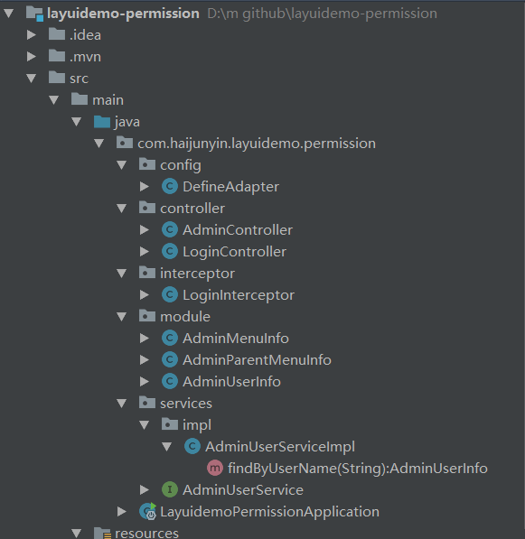
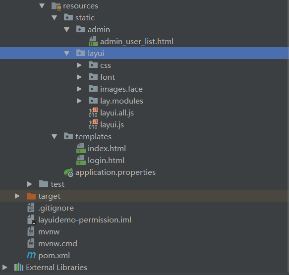
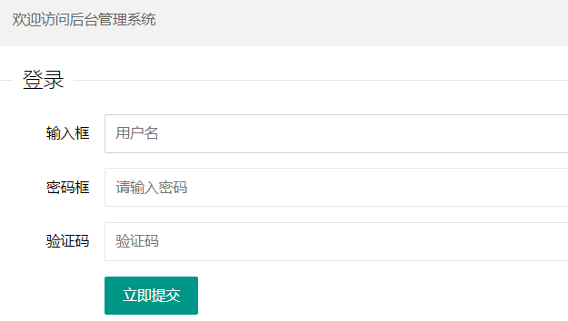
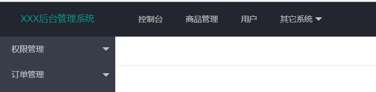
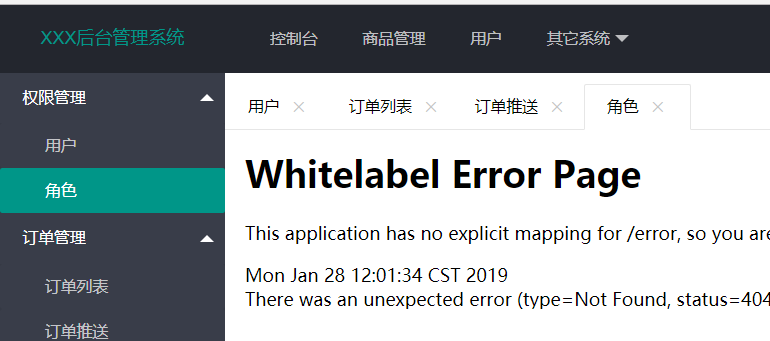

layui是一个专门为后台而设计的一个前端框架，功能强大，特别适合后端开发人员，本文以一个demo把登录模块和权限模块基本原理说明，详细的内容可以参考[layui的官方文档](https://www.layui.com/doc/)
## 搭建项目
项目架构是springboot+thymeleaf+layui，结构如下图，文件有点多，分成两张图



其中resources资源文件里的layui文件夹下就是layui的所有文件，内容需要到官网下载，解压后全部复制即可

pom.xml
```xml
<?xml version="1.0" encoding="UTF-8"?>
<project xmlns="http://maven.apache.org/POM/4.0.0" xmlns:xsi="http://www.w3.org/2001/XMLSchema-instance"
    xsi:schemaLocation="http://maven.apache.org/POM/4.0.0 http://maven.apache.org/xsd/maven-4.0.0.xsd">
    <modelVersion>4.0.0</modelVersion>
    <parent>
        <groupId>org.springframework.boot</groupId>
        <artifactId>spring-boot-starter-parent</artifactId>
        <version>2.1.2.RELEASE</version>
        <relativePath/> <!-- lookup parent from repository -->
    </parent>
    <groupId>com.haijunyin</groupId>
    <artifactId>layuidemo-permission</artifactId>
    <version>0.0.1-SNAPSHOT</version>
    <name>layuidemo-permission</name>
    <description>Demo project for Spring Boot</description>
    <packaging>war</packaging>
    <properties>
        <java.version>1.8</java.version>
    </properties>

    <dependencies>
        <dependency>
            <groupId>org.springframework.boot</groupId>
            <artifactId>spring-boot-starter-web</artifactId>
            <!-- 排除内置容器，排除内置容器导出成war包可以让外部容器运行spring-boot项目-->
            <exclusions>
                <exclusion>
                    <groupId>org.springframework.boot</groupId>
                    <artifactId>spring-boot-starter-tomcat</artifactId>
                </exclusion>
            </exclusions>
        </dependency>

        <dependency>
            <groupId>javax.servlet</groupId>
            <artifactId>javax.servlet-api</artifactId>
            <version>4.0.0</version>
            <scope>provided</scope>
        </dependency>

        <dependency>
            <groupId>org.thymeleaf</groupId>
            <artifactId>thymeleaf</artifactId>
            <version>3.0.11.RELEASE</version>
        </dependency>
        <dependency>
            <groupId>org.thymeleaf</groupId>
            <artifactId>thymeleaf-spring4</artifactId>
            <version>3.0.11.RELEASE</version>
        </dependency>
        <dependency>
            <groupId>org.springframework.boot</groupId>
            <artifactId>spring-boot-starter-thymeleaf</artifactId>
        </dependency>

        <dependency>
            <groupId>org.springframework.boot</groupId>
            <artifactId>spring-boot-starter-test</artifactId>
            <scope>test</scope>
        </dependency>
    </dependencies>

    <build>
        <plugins>
            <plugin>
                <groupId>org.springframework.boot</groupId>
                <artifactId>spring-boot-maven-plugin</artifactId>
            </plugin>
        </plugins>
    </build>

</project>
```

application.properties
```
#thymelea模板配置
xspring.thymeleaf.prefi=classpath:/templates/
spring.thymeleaf.suffix=.html
spring.thymeleaf.mode=HTML5
spring.thymeleaf.encoding=UTF-8
#热部署文件，页面不产生缓存，及时更新
spring.thymeleaf.cache=false
spring.resources.chain.strategy.content.enabled=true
spring.resources.chain.strategy.content.paths=/**
```
LayuidemoPermissionApplication.java
```java
package com.haijunyin.layuidemo.permission;

import org.springframework.boot.SpringApplication;
import org.springframework.boot.autoconfigure.SpringBootApplication;
import org.springframework.boot.autoconfigure.jdbc.DataSourceAutoConfiguration;
import org.springframework.boot.builder.SpringApplicationBuilder;
import org.springframework.boot.web.servlet.support.SpringBootServletInitializer;
import org.springframework.context.annotation.ComponentScan;
import org.springframework.scheduling.annotation.EnableAsync;

/**
 * 继承SpringBootServletInitializer，因为继承SpringBootServletInitializer是继承WebApplicationInitializer的，而servlet容器启动的时候
 * 会将WebApplicationInitializer相关的所有子类实例化(这也是servlet3.0以上的版本提供支持)，所以我们还需要在pom.xml
 * 文件中导入servlet3.0及以上的版本
 */
@ComponentScan(value = "com.haijunyin.layuidemo.permission")
@SpringBootApplication(exclude = {DataSourceAutoConfiguration.class})
@EnableAsync
public class LayuidemoPermissionApplication extends SpringBootServletInitializer{

    @Override
    public SpringApplicationBuilder configure(SpringApplicationBuilder builder) {
        return builder.sources(LayuidemoPermissionApplication.class);
    }

    public static void main(String[] args) {
        SpringApplication.run(LayuidemoPermissionApplication.class, args);
    }

}

```
admin_user_list.html
```html
<!DOCTYPE html>
<html>
<head>
    <meta charset="utf-8">
    <meta name="viewport" content="width=device-width, user-scalable=no, initial-scale=1.0, maximum-scale=1.0, minimum-scale=1.0">
    <title>layui在线调试</title>
    <link rel="stylesheet" href="../layui/css/layui.css" media="all">
    <style>
        body{margin: 10px;}
        .demo-carousel{height: 200px; line-height: 200px; text-align: center;}
    </style>
</head>
<body>

<table class="layui-hide" id="demo" lay-filter="test"></table>

<script type="text/html" id="barDemo">
    <a class="layui-btn layui-btn-primary layui-btn-xs" lay-event="detail">查看</a>
    <a class="layui-btn layui-btn-xs" lay-event="edit">编辑</a>
    <a class="layui-btn layui-btn-danger layui-btn-xs" lay-event="del">删除</a>
</script>

<div class="layui-tab layui-tab-brief" lay-filter="demo">
    <ul class="layui-tab-title">
        <li class="layui-this">演示说明</li>
        <li>日期</li>
        <li>分页</li>
        <li>上传</li>
        <li>滑块</li>
    </ul>
    <div class="layui-tab-content">
        <div class="layui-tab-item layui-show">

            <div class="layui-carousel" id="test1">
                <div carousel-item>
                    <div><p class="layui-bg-green demo-carousel">在这里，你将以最直观的形式体验 layui！</p></div>
                    <div><p class="layui-bg-red demo-carousel">在编辑器中可以执行 layui 相关的一切代码</p></div>
                    <div><p class="layui-bg-blue demo-carousel">你也可以点击左侧导航针对性地试验我们提供的示例</p></div>
                    <div><p class="layui-bg-orange demo-carousel">如果最左侧的导航的高度超出了你的屏幕</p></div>
                    <div><p class="layui-bg-cyan demo-carousel">你可以将鼠标移入导航区域，然后滑动鼠标滚轮即可</p></div>
                </div>
            </div>
        </div>
        <div class="layui-tab-item">
            <div id="laydateDemo"></div>
        </div>
        <div class="layui-tab-item">
            <div id="pageDemo"></div>
        </div>
        <div class="layui-tab-item">
            <div class="layui-upload-drag" id="uploadDemo">
                <i class="layui-icon"></i>
                <p>点击上传，或将文件拖拽到此处</p>
            </div>
        </div>
        <div class="layui-tab-item">
            <div id="sliderDemo" style="margin: 50px 20px;"></div>
        </div>
    </div>
</div>

<blockquote class="layui-elem-quote layui-quote-nm layui-hide" id="footer">layui {{ layui.v }} 提供强力驱动</blockquote>


<script src="../layui/layui.js"></script>
<script>
    layui.config({
        version: '1545041465480' //为了更新 js 缓存，可忽略
    });

    layui.use(['laydate', 'laypage', 'layer', 'table', 'carousel', 'upload', 'element', 'slider'], function(){
        var laydate = layui.laydate //日期
            ,laypage = layui.laypage //分页
            ,layer = layui.layer //弹层
            ,table = layui.table //表格
            ,carousel = layui.carousel //轮播
            ,upload = layui.upload //上传
            ,element = layui.element //元素操作
            ,slider = layui.slider //滑块

        //向世界问个好
        layer.msg('Hello World');

        //监听Tab切换
        element.on('tab(demo)', function(data){
            layer.tips('切换了 '+ data.index +'：'+ this.innerHTML, this, {
                tips: 1
            });
        });

        //执行一个 table 实例
        table.render({
            elem: '#demo'
            ,height: 420
            ,url: '/demo/table/user/' //数据接口
            ,title: '用户表'
            ,page: true //开启分页
            ,toolbar: 'default' //开启工具栏，此处显示默认图标，可以自定义模板，详见文档
            ,totalRow: true //开启合计行
            ,cols: [[ //表头
                {type: 'checkbox', fixed: 'left'}
                ,{field: 'id', title: 'ID', width:80, sort: true, fixed: 'left', totalRowText: '合计：'}
                ,{field: 'username', title: '用户名', width:80}
                ,{field: 'experience', title: '积分', width: 90, sort: true, totalRow: true}
                ,{field: 'sex', title: '性别', width:80, sort: true}
                ,{field: 'score', title: '评分', width: 80, sort: true, totalRow: true}
                ,{field: 'city', title: '城市', width:150}
                ,{field: 'sign', title: '签名', width: 200}
                ,{field: 'classify', title: '职业', width: 100}
                ,{field: 'wealth', title: '财富', width: 135, sort: true, totalRow: true}
                ,{fixed: 'right', width: 165, align:'center', toolbar: '#barDemo'}
            ]]
        });

        //监听头工具栏事件
        table.on('toolbar(test)', function(obj){
            var checkStatus = table.checkStatus(obj.config.id)
                ,data = checkStatus.data; //获取选中的数据
            switch(obj.event){
                case 'add':
                    layer.msg('添加');
                    break;
                case 'update':
                    if(data.length === 0){
                        layer.msg('请选择一行');
                    } else if(data.length > 1){
                        layer.msg('只能同时编辑一个');
                    } else {
                        layer.alert('编辑 [id]：'+ checkStatus.data[0].id);
                    }
                    break;
                case 'delete':
                    if(data.length === 0){
                        layer.msg('请选择一行');
                    } else {
                        layer.msg('删除');
                    }
                    break;
            };
        });

        //监听行工具事件
        table.on('tool(test)', function(obj){ //注：tool 是工具条事件名，test 是 table 原始容器的属性 lay-filter="对应的值"
            var data = obj.data //获得当前行数据
                ,layEvent = obj.event; //获得 lay-event 对应的值
            if(layEvent === 'detail'){
                layer.msg('查看操作');
            } else if(layEvent === 'del'){
                layer.confirm('真的删除行么', function(index){
                    obj.del(); //删除对应行（tr）的DOM结构
                    layer.close(index);
                    //向服务端发送删除指令
                });
            } else if(layEvent === 'edit'){
                layer.msg('编辑操作');
            }
        });

        //执行一个轮播实例
        carousel.render({
            elem: '#test1'
            ,width: '100%' //设置容器宽度
            ,height: 200
            ,arrow: 'none' //不显示箭头
            ,anim: 'fade' //切换动画方式
        });

        //将日期直接嵌套在指定容器中
        var dateIns = laydate.render({
            elem: '#laydateDemo'
            ,position: 'static'
            ,calendar: true //是否开启公历重要节日
            ,mark: { //标记重要日子
                '0-10-14': '生日'
                ,'2018-08-28': '新版'
                ,'2018-10-08': '神秘'
            }
            ,done: function(value, date, endDate){
                if(date.year == 2017 && date.month == 11 && date.date == 30){
                    dateIns.hint('一不小心就月底了呢');
                }
            }
            ,change: function(value, date, endDate){
                layer.msg(value)
            }
        });

        //分页
        laypage.render({
            elem: 'pageDemo' //分页容器的id
            ,count: 100 //总页数
            ,skin: '#1E9FFF' //自定义选中色值
            //,skip: true //开启跳页
            ,jump: function(obj, first){
                if(!first){
                    layer.msg('第'+ obj.curr +'页', {offset: 'b'});
                }
            }
        });

        //上传
        upload.render({
            elem: '#uploadDemo'
            ,url: '' //上传接口
            ,done: function(res){
                console.log(res)
            }
        });

        slider.render({
            elem: '#sliderDemo'
            ,input: true //输入框
        });

        //底部信息
        var footerTpl = lay('#footer')[0].innerHTML;
        lay('#footer').html(layui.laytpl(footerTpl).render({}))
            .removeClass('layui-hide');
    });
</script>
</body>
</html>
```

index.html，此文件是显示菜单的主要文件
```html
<!DOCTYPE html>
<html xmlns:th="http://www.thymeleaf.org">
<head>
    <meta charset="utf-8">
    <meta name="viewport" content="width=device-width, initial-scale=1, maximum-scale=1">
    <title>XXX后台管理系统</title>
    <link rel="stylesheet" th:href="@{layui/css/layui.css}">
</head>
<body class="layui-layout-body">
<div class="layui-layout layui-layout-admin">
    <div class="layui-header">
        <div class="layui-logo">XXX后台管理系统</div>
        <!-- 头部区域（可配合layui已有的水平导航） -->
        <ul class="layui-nav layui-layout-left">
            <li class="layui-nav-item"><a href="">控制台</a></li>
            <li class="layui-nav-item"><a href="">商品管理</a></li>
            <li class="layui-nav-item"><a href="">用户</a></li>
            <li class="layui-nav-item">
                <a href="javascript:;">其它系统</a>
                <dl class="layui-nav-child">
                    <dd><a href="">邮件管理</a></dd>
                    <dd><a href="">消息管理</a></dd>
                    <dd><a href="">授权管理</a></dd>
                </dl>
            </li>
        </ul>
        <ul class="layui-nav layui-layout-right">
            <li class="layui-nav-item">
                <a href="javascript:;">
                    
                    <span th:text="${adminUserInfo.userName}"></span>
                </a>
                <dl class="layui-nav-child">
                    <dd><a href="">基本资料</a></dd>
                    <dd><a href="">安全设置</a></dd>
                </dl>
            </li>
            <li class="layui-nav-item"><a href="">退了</a></li>
        </ul>
    </div>

    <div class="layui-side layui-bg-black">
        <div class="layui-side-scroll">
            <!-- 左侧导航区域（可配合layui已有的垂直导航） -->
            <ul class="layui-nav layui-nav-tree">

                <li class="layui-nav-item" th:each="adminParentMenuInfo : ${adminUserInfo.adminParentMenuInfos}">
                    <a class="" href="javascript:;" th:text="${adminParentMenuInfo.parentMenuName}"></a>
                    <dl class="layui-nav-child" th:each="adminMenuInfo : ${adminParentMenuInfo.adminMenuInfos}">
                        <dd class="layui-nav">
                            <a href="javascript:;" th:id="${adminMenuInfo.filterId}" th:zdy-url="${adminMenuInfo.menuUrl}">
                                <cite th:text="${adminMenuInfo.menuName}"></cite>
                            </a>
                        </dd>
                    </dl>
                </li>

            </ul>
        </div>
    </div>

    <div class="layui-body">
        <div class="layui-tab" lay-allowClose="true" lay-filter="demo">
            <ul class="layui-tab-title" id="myLayuiTab">
            </ul>
            <div class="layui-tab-content">
            </div>
        </div>
    </div>

    <div class="layui-footer">
        <!-- 底部固定区域 -->
        © layui.com - 底部固定区域
    </div>
</div>
<script th:src="@{layui/layui.js}"></script>
<script>
    //JavaScript代码区域
    layui.use('element', function(){
        var element = layui.element;
        element.on('nav', function(data){
//            console.log(this); //当前Tab标题所在的原始DOM元素
            var zdyUrl = this.getAttribute("zdy-url"); //获取url
            var layId = this.getAttribute("id"); //获取id
            var title = this.getElementsByTagName("cite").item(0).textContent;
            //组装content
            var content = '<iframe  frameborder="0" scrolling="no" width="100%" height="100%" src="' + zdyUrl + '"></iframe>';

            //判断myLayuiTab中有没有重复，如果有，则不添加
            var documentLis = document.getElementById("myLayuiTab").getElementsByTagName("li");
            var flag = false;
            for(var i=0; i<documentLis.length; i++){
                var documentLi = documentLis[i];
                var layIdView = documentLi.getAttribute("lay-id");
                if(layId == layIdView){
                    flag = true;
                }
            }
            if(!flag) {
                //添加
                element.tabAdd('demo', {
                    title: title
                    , content: content
                    , id: layId
                });
            }
            //切换
            element.tabChange('demo', layId);
        });

    });

</script>
</body>
</html>

```

login.html，登录页
```html
<!DOCTYPE html>
<html xmlns:th="http://www.thymeleaf.org">
<head>
    <meta charset="utf-8">
    <title>XXX后台登录</title>
    <meta name="renderer" content="webkit">
    <meta http-equiv="X-UA-Compatible" content="IE=edge,chrome=1">
    <meta name="viewport" content="width=device-width, initial-scale=1, maximum-scale=1">
    <link rel="stylesheet" th:href="@{layui/css/layui.css}"  media="all">
</head>
<body>

<blockquote class="layui-elem-quote layui-text">
    欢迎访问后台管理系统
</blockquote>

<fieldset class="layui-elem-field layui-field-title" style="margin-top: 20px;">
    <legend>登录</legend>
</fieldset>

<form class="form-horizontal" th:action="@{/login}" method="get">
    <div class="layui-form-item">
        <label class="layui-form-label">输入框</label>
        <div class="layui-input-block">
            <input type="text" name="userName" lay-verify="title" autocomplete="off" placeholder="用户名" required="true" class="layui-input">
        </div>
    </div>
    <div class="layui-form-item">
        <label class="layui-form-label">密码框</label>
        <div class="layui-input-block">
            <input type="password" name="userPwd" placeholder="请输入密码" autocomplete="off" class="layui-input">
        </div>
    </div>
    <div class="layui-form-item">
        <label class="layui-form-label">验证码</label>
        <div class="layui-input-block">
            <input type="text" name="verifyCode" placeholder="验证码" autocomplete="off" class="layui-input">
        </div>
    </div>
    <div class="layui-form-item">
        <div class="layui-input-block">
            <button class="layui-btn" lay-submit="" lay-filter="demo1">立即提交</button>
        </div>
    </div>
</form>
<script th:src="@{layui/layui.js}" charset="utf-8"></script>
</body>
</html>
```

layui下的所有文件都是官网下载然后解压的

DefineAdapter.java，拦截器配置
```java
package com.haijunyin.layuidemo.permission.config;

import com.haijunyin.layuidemo.permission.interceptor.LoginInterceptor;
import org.springframework.beans.factory.annotation.Autowired;
import org.springframework.context.annotation.Configuration;
import org.springframework.web.servlet.config.annotation.InterceptorRegistry;
import org.springframework.web.servlet.config.annotation.WebMvcConfigurer;

import java.util.ArrayList;
import java.util.List;

@Configuration
public class DefineAdapter implements WebMvcConfigurer {

    @Autowired
    private LoginInterceptor loginInterceptor;

    //登录拦截器
    @Override
    public void addInterceptors(InterceptorRegistry registry) {

        //排除不被拦截的资源
        List<String> excludePaths = new ArrayList<>();
        //layui的静态文件
        excludePaths.add("/layui/**");

        //静态页面
        excludePaths.add("/**/*.html");

        //登录
        excludePaths.add("/");
        excludePaths.add("/login");
//        excludePaths.add("/error");

        registry.addInterceptor(loginInterceptor).
                addPathPatterns("/**").excludePathPatterns(excludePaths);

    }


}
```

AdminController.java
```java
package com.haijunyin.layuidemo.permission.controller;

import org.springframework.web.bind.annotation.RequestMapping;
import org.springframework.web.bind.annotation.RequestMethod;
import org.springframework.web.bind.annotation.RestController;

@RestController
@RequestMapping(value = "admin")
public class AdminController {

    @RequestMapping(value = "list",method = RequestMethod.GET)
    public String list(){
        return "权限List测试";
    }

}
```
LoginController.java
```java
package com.haijunyin.layuidemo.permission.controller;

import com.haijunyin.layuidemo.permission.module.AdminUserInfo;
import com.haijunyin.layuidemo.permission.services.AdminUserService;
import org.springframework.beans.factory.annotation.Autowired;
import org.springframework.stereotype.Controller;
import org.springframework.ui.ModelMap;
import org.springframework.web.bind.annotation.RequestMapping;
import org.springframework.web.bind.annotation.RequestMethod;
import org.springframework.web.bind.annotation.RequestParam;

import javax.servlet.http.HttpServletRequest;
import javax.servlet.http.HttpServletResponse;
import javax.servlet.http.HttpSession;

@Controller
public class LoginController {

    @Autowired
    private AdminUserService adminUserService;

    /**
     * 设置默认打开地址http://localhost:8020的跳转(需要在拦截器中排除)
     * 1.已登录，跳转到index.html，把adminUserInfo返回前端渲染
     * 2.未登录，跳转到登录页
     */
    @RequestMapping(value = "/",method = RequestMethod.GET)
    public String index(HttpServletRequest request, ModelMap modelMap){
        HttpSession session = request.getSession();
        AdminUserInfo adminUserInfo = (AdminUserInfo) session.getAttribute("adminUserInfo");
        if(null != adminUserInfo){
            modelMap.addAttribute("adminUserInfo",adminUserInfo);
            return "index";
        }else{
            return "login";
        }
    }

    /**
     * 登录(需要在拦截器中排除)
     * 1.已登录，跳转到index.html，把adminUserInfo返回前端渲染
     * 2.未登录，验证密码，如果密码正确，跳转到index.html, 则把用户信息放入session，并把adminUserInfo返回前端渲染
     *                     如果密码错误，跳转到login.html
     */
    @RequestMapping(value = "/login",method = RequestMethod.GET)
    public String login(@RequestParam(value = "userName", required = false) String userName,
                        @RequestParam(value = "userPwd", required = false) String userPwd,
                        @RequestParam(value = "verifyCode", required = false) String verifyCode,
                        HttpServletRequest request,
                        ModelMap modelMap){

        //先验证session，再验证密码
        HttpSession session = request.getSession();
        AdminUserInfo adminUserInfo = (AdminUserInfo) session.getAttribute("adminUserInfo");
        if(null != adminUserInfo){
            modelMap.addAttribute("adminUserInfo",adminUserInfo);
            return "index";
        }else{
            //验证密码
            AdminUserInfo adminUserInfo0 = adminUserService.findByUserName(userName);
            System.out.println("验证登录...userName="+userName+"userPwd="+userPwd+"verifyCode="+verifyCode);
            if(adminUserInfo0.getUserPwd().equals(userPwd)){
                //用户信息放入session
                System.out.println("登录...成功..." + "用户名：" + userName);
                request.getSession().setAttribute("adminUserInfo", adminUserInfo0);
                modelMap.addAttribute("adminUserInfo",adminUserInfo0);
                return "index";
            }else{
                System.out.println("登录...密码输入错误..." + "用户名：" + userName);
                return "login";
            }
        }
    }

}
```
LoginInterceptor.java，登录拦截器，用于拦截处理登录和为登录状态下的ajax请求
```java
package com.haijunyin.layuidemo.permission.interceptor;

import com.haijunyin.layuidemo.permission.module.AdminUserInfo;
import org.springframework.stereotype.Service;
import org.springframework.web.servlet.handler.HandlerInterceptorAdapter;

import javax.servlet.http.HttpServletRequest;
import javax.servlet.http.HttpServletResponse;
import javax.servlet.http.HttpSession;

@Service
public class LoginInterceptor extends HandlerInterceptorAdapter{

    @Override
    public boolean preHandle(HttpServletRequest request, HttpServletResponse response, Object handler) throws Exception {
        HttpSession session = request.getSession();
        AdminUserInfo adminUserInfo = (AdminUserInfo) session.getAttribute("adminUserInfo");
        //未登录去登录
        if(null == adminUserInfo){
            //注意：这里需要写上"/login"，而不是"login"，否则重定向的地址只会替换最后一个"/"后面的字符串
            response.sendRedirect("/login");
        }
        return true;
    }

}
```

AdminMenuInfo.java，子菜单信息，权限需要真正控制的信息
```java
package com.haijunyin.layuidemo.permission.module;

public class AdminMenuInfo {

    /** 子菜单唯一ID，在页面上面会以它做唯一区分的，对应到相应子窗口的lay-id属性 */
    private String filterId;

    /** 子菜单名，对应子窗口的title */
    private String menuName;

    /** 子菜单URL，对应子窗口的链接html，点击子菜单后，会打开一个iframe并链接到此url */
    private String menuUrl;

    public AdminMenuInfo(){

    }

    public AdminMenuInfo(String filterId, String menuName, String menuUrl){
        this.filterId = filterId;
        this.menuName = menuName;
        this.menuUrl = menuUrl;
    }

    public String getFilterId() {
        return filterId;
    }

    public void setFilterId(String filterId) {
        this.filterId = filterId;
    }

    public String getMenuName() {
        return menuName;
    }

    public void setMenuName(String menuName) {
        this.menuName = menuName;
    }

    public String getMenuUrl() {
        return menuUrl;
    }

    public void setMenuUrl(String menuUrl) {
        this.menuUrl = menuUrl;
    }
}

```
AdminParentInfo.java，父菜单信息
```java
package com.haijunyin.layuidemo.permission.module;

import java.util.List;

public class AdminParentMenuInfo {

    private String parentMenuName;

    private List<AdminMenuInfo> adminMenuInfos;

    public AdminParentMenuInfo(){

    }

    public AdminParentMenuInfo(String parentMenuName, List<AdminMenuInfo> adminMenuInfos){
        this.parentMenuName = parentMenuName;
        this.adminMenuInfos = adminMenuInfos;
    }

    public String getParentMenuName() {
        return parentMenuName;
    }

    public void setParentMenuName(String parentMenuName) {
        this.parentMenuName = parentMenuName;
    }

    public List<AdminMenuInfo> getAdminMenuInfos() {
        return adminMenuInfos;
    }

    public void setAdminMenuInfos(List<AdminMenuInfo> adminMenuInfos) {
        this.adminMenuInfos = adminMenuInfos;
    }
}
```
AdminUserInfo.java，用户信息，用户登陆后会放入session
```java
package com.haijunyin.layuidemo.permission.module;

import java.util.List;

public class AdminUserInfo {

    private long id;

    private String userName;

    private String userPwd;

    private List<AdminParentMenuInfo> adminParentMenuInfos;

    public long getId() {
        return id;
    }

    public void setId(long id) {
        this.id = id;
    }

    public String getUserName() {
        return userName;
    }

    public void setUserName(String userName) {
        this.userName = userName;
    }

    public String getUserPwd() {
        return userPwd;
    }

    public void setUserPwd(String userPwd) {
        this.userPwd = userPwd;
    }

    public List<AdminParentMenuInfo> getAdminParentMenuInfos() {
        return adminParentMenuInfos;
    }

    public void setAdminParentMenuInfos(List<AdminParentMenuInfo> adminParentMenuInfos) {
        this.adminParentMenuInfos = adminParentMenuInfos;
    }
}
```
AdminUserService.java
```java
package com.haijunyin.layuidemo.permission.services;


import com.haijunyin.layuidemo.permission.module.AdminUserInfo;

public interface AdminUserService {

    AdminUserInfo findByUserName(String userName);

}
```
AdminUserServiceImpl.java，用户登陆信息加载，实际开发过程中，信息都是从数据库中读取的，设计用户-角色-资源的模型结构，本文不做叙述，
```java
package com.haijunyin.layuidemo.permission.services.impl;

import com.haijunyin.layuidemo.permission.module.AdminMenuInfo;
import com.haijunyin.layuidemo.permission.module.AdminParentMenuInfo;
import com.haijunyin.layuidemo.permission.module.AdminUserInfo;
import com.haijunyin.layuidemo.permission.services.AdminUserService;
import org.springframework.stereotype.Service;

import java.util.ArrayList;
import java.util.List;

@Service
public class AdminUserServiceImpl implements AdminUserService {

    @Override
    public AdminUserInfo findByUserName(String userName) {
        AdminUserInfo userInfo = new AdminUserInfo();
        userInfo.setId(1);
        userInfo.setUserName("yhj");
        userInfo.setUserPwd("123456");
        List<AdminParentMenuInfo> adminParentMenuInfos = new ArrayList<>();
        //权限管理
        List<AdminMenuInfo> adminMenuInfos1 = new ArrayList<>();
        AdminMenuInfo adminMenuInfo1 = new AdminMenuInfo("filter1","用户","admin/admin_user_list.html");
        adminMenuInfos1.add(adminMenuInfo1);
        AdminMenuInfo adminMenuInfo2 = new AdminMenuInfo("filter2", "角色","admin/admin_role_list.html");
        adminMenuInfos1.add(adminMenuInfo2);
        AdminParentMenuInfo adminParentMenuInfo1 = new AdminParentMenuInfo("权限管理",adminMenuInfos1);
        adminParentMenuInfos.add(adminParentMenuInfo1);
        //订单管理
        List<AdminMenuInfo> adminMenuInfos2 = new ArrayList<>();
        AdminMenuInfo adminMenuInfo11 = new AdminMenuInfo("filter3", "订单列表","order/order_list.html");
        adminMenuInfos2.add(adminMenuInfo11);
        AdminMenuInfo adminMenuInfo22 = new AdminMenuInfo("filter4", "订单推送","order/order_send.html");
        adminMenuInfos2.add(adminMenuInfo22);
        AdminParentMenuInfo adminParentMenuInfo2 = new AdminParentMenuInfo("订单管理",adminMenuInfos2);
        adminParentMenuInfos.add(adminParentMenuInfo2);

        userInfo.setAdminParentMenuInfos(adminParentMenuInfos);
        return userInfo;
    }
}
```
## 运行结果
浏览器中输入地址
```
http://localhost:8020/
```
弹出登陆页面


输入用户名，密码(123456)，出现首页


点击权限管理或订单管理，出现子窗口信息


## 总结
到此，Demo结束，可以看出一个完整的登陆和权限也是不简单的，本文只是把主干完成了，细节的东西没用去设计，比如登陆页的校验、验证码，还有权限的表设计，等等，不过这些都不是问题了，后续只需要慢慢完善即可，我们通过这个Demo，已经成功地开启了layui的大门


源码：https://github.com/haijunY/demos-past/tree/master/frame-layui