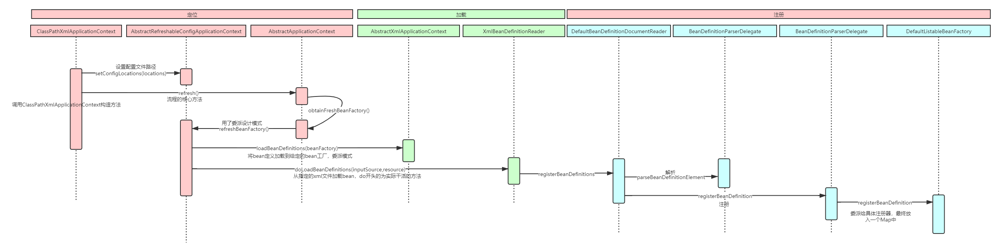
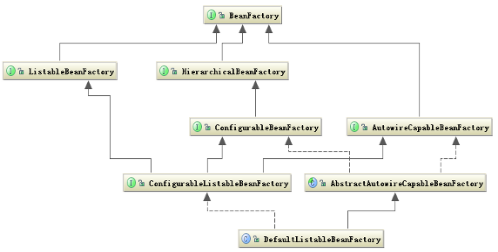

### Spring的IOC理解

1、IOC就是控制反转，是指创建对象的控制权的转移，以前创建对象的主动权和时机是由自己把握的，而现在这种权利转移到Spring容器中，并由容器根据配置文件去创建实例和管理各个实例之间的依赖关系，对象与对象之间低耦合，利于功能复用。DI依赖注入，和控制反转是同一个概念的不同角度描述，即应用程序在运行时依赖IOC容器来动态注入对象需要的外部资源

2、最直观的表达就是，IOC让对象的创建不用去new了，可以由spring自动生产，使用java的反射机制，根据配置文件在运行时动态地去创建对象和管理对象，并调用对象的方法

3、Spring的IOC由三种注入方式：构造器注入、setter方法注入、注解注入

### BeanFactory和ApplicationContext

 BeanFactory和ApplicationContext是Spring的两大核心接口，都可以当做Spring的容器。其中ApplicationContext是BeanFactory的子接口

1、BeanFactory包含了各种Bean的定义，读取Bean配置文档，管理Bean的加载、实例化，控制Bean的生命周期，维护Bean之间的依赖关系。ApplicationContext接口作为BeanFactory的子类，具有更强大的功能，

2、BeanFactory采用的是延迟加载形式来注入Bean的，即只有在使用某个Bean时，才对该Bean进行加载实例化，这样我们就不能提前发现一些存在的Spring的配置问题。ApplicationContext是在容器启动时，一次性创建了所有的Bean

3、BeanFactory通常以编程式方式被创建，ApplicationContext以声明式方式创建

### Spring-IOC的时序图

processon的地址为https://www.processon.com/diagraming/5ce38218e4b06c0492f8f837

下图表示BeanFactory类关系图

​	IOC的过程是把资源转化到DefaultListableBeanFactory中的beanDefinitionMap中的过程，那么BeanDefinition是什么呢，这个是对一个Bean资源的一个抽象定义，有了它，可根据里面的类名、构造函数、参数使用反射进行对象创建

### Spring Bean的生命周期

1、实例化Bean

对于BeanFactory容器，当客户向容器请求一个尚未初始化的bean时，或初始化Bean的时候需要注入另一个尚未初始化的依赖时，容器会调用createBean进行实例化，对于ApplicationContext容器，当容器启动结束后，通过BeanDefinition对象中的信息，实例化所有的Bean

2、设置对象属性（依赖注入）

实例化后的对象被封装在BeanWrapper对象中，紧接着，Spring根据BeanDefinition中的信息以及通过BeanWrapper提供的设置属性的接口完成依赖注入

3、处理Aware接口

接着，Spring会检测该对象是否实现了xxxAware接口，并将相关的实例注入给Bean：

①如果这个Bean已经实现了BeanNameAware接口，会调用它实现的setBeanName(String beanId)方法，此处传递的就是Spring配置文件中Bean的id值；

②如果这个Bean已经实现了BeanFactoryAware接口，会调用它实现的setBeanFactory()方法，传递的是Spring工厂自身。

③如果这个Bean已经实现了ApplicationContextAware接口，会调用setApplicationContext(ApplicationContext)方法，传入Spring上下文；

4、BeanPostProcessor

如果想对Bean进行一些自定义的处理，那么可以让Bean实现BeanPostProcessor接口

5、InitialzingBean与init-method

如果Bean在Spring的配置文件中配置了init-method属性，则会自动调用其配置的初始化方法

6、DisposableBean

当Bean不在需要时，会经过清理阶段，如果Bean实现了DispoisableBean这个接口，会调用其实现的destory()方法

7、destroy-method

最后，如果这个Bean的Spring配置中配置了destroy-method属性，会自动调用其配置的销毁方法

