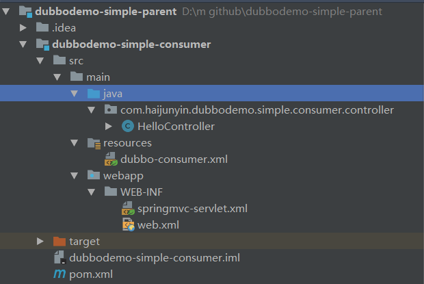
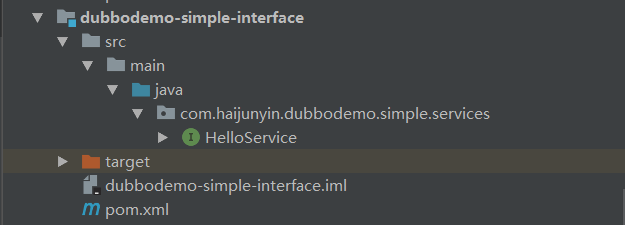
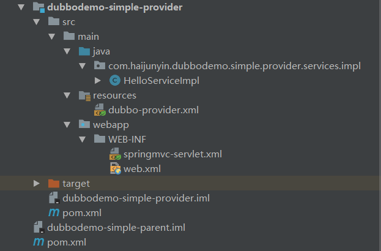

## 构建过程
dubbo服务有服务方provider和消费方consumer，整个项目用tomcat做容器，在创建demo之前请先安装zookeeper
项目结构如图




主pom.xml
```xml
<?xml version="1.0" encoding="UTF-8"?>
<project xmlns="http://maven.apache.org/POM/4.0.0"
         xmlns:xsi="http://www.w3.org/2001/XMLSchema-instance"
         xsi:schemaLocation="http://maven.apache.org/POM/4.0.0 http://maven.apache.org/xsd/maven-4.0.0.xsd">
    <modelVersion>4.0.0</modelVersion>

    <groupId>com.haijunyin</groupId>
    <artifactId>dubbodemo-simple-parent</artifactId>
    <packaging>pom</packaging>
    <version>1.0-SNAPSHOT</version>
    <modules>
        <module>dubbodemo-simple-provider</module>
        <module>dubbodemo-simple-consumer</module>
        <module>dubbodemo-simple-interface</module>
    </modules>

</project>
```
## provider
pom.xml
```xml
<?xml version="1.0" encoding="UTF-8"?>
<project xmlns="http://maven.apache.org/POM/4.0.0"
         xmlns:xsi="http://www.w3.org/2001/XMLSchema-instance"
         xsi:schemaLocation="http://maven.apache.org/POM/4.0.0 http://maven.apache.org/xsd/maven-4.0.0.xsd">
    <parent>
        <artifactId>dubbodemo-simple-parent</artifactId>
        <groupId>com.haijunyin</groupId>
        <version>1.0-SNAPSHOT</version>
    </parent>
    <modelVersion>4.0.0</modelVersion>

    <artifactId>dubbodemo-simple-provider</artifactId>

    <packaging>war</packaging>

    <dependencies>
        <!-- 本地依赖 -->
        <dependency>
            <groupId>com.haijunyin</groupId>
            <artifactId>dubbodemo-simple-interface</artifactId>
            <version>1.0-SNAPSHOT</version>
        </dependency>

        <!-- spring -->
        <dependency>
            <groupId>org.springframework</groupId>
            <artifactId>spring-web</artifactId>
            <version>4.3.8.RELEASE</version>
        </dependency>
        <dependency>
            <groupId>org.springframework</groupId>
            <artifactId>spring-webmvc</artifactId>
            <version>4.3.8.RELEASE</version>
        </dependency>

        <dependency>
            <groupId>javax.servlet</groupId>
            <artifactId>javax.servlet-api</artifactId>
            <version>3.1.0</version>
        </dependency>
        <!-- dubbo -->
        <dependency>
            <groupId>com.alibaba</groupId>
            <artifactId>dubbo</artifactId>
            <version>2.5.5</version>
        </dependency>

        <!-- zk -->
        <dependency>
            <groupId>com.github.sgroschupf</groupId>
            <artifactId>zkclient</artifactId>
            <version>0.1</version>
        </dependency>
    </dependencies>

    <build>
        <plugins>
            <plugin>
                <groupId>org.apache.maven.plugins</groupId>
                <artifactId>maven-compiler-plugin</artifactId>
                <configuration>
                    <source>1.6</source>
                    <target>1.6</target>
                </configuration>
            </plugin>
        </plugins>
    </build>

</project>
```
web.xml
```xml
<?xml version="1.0" encoding="UTF-8"?>
<web-app xmlns:xsi="http://www.w3.org/2001/XMLSchema-instance" xmlns="http://java.sun.com/xml/ns/javaee" xsi:schemaLocation="http://java.sun.com/xml/ns/javaee http://java.sun.com/xml/ns/javaee/web-app_3_0.xsd" id="WebApp_ID" version="3.0">
    <display-name>web02</display-name>

    <servlet>
        <servlet-name>springmvc</servlet-name>
        <servlet-class>org.springframework.web.servlet.DispatcherServlet</servlet-class>
        <load-on-startup>1</load-on-startup>
    </servlet>

    <servlet-mapping>
        <servlet-name>springmvc</servlet-name>
        <url-pattern>/</url-pattern>
    </servlet-mapping>

</web-app>
```
springmvc-servlet.xml
```xml
<?xml version="1.0" encoding="UTF-8"?>
<beans xmlns="http://www.springframework.org/schema/beans"
       xmlns:xsi="http://www.w3.org/2001/XMLSchema-instance"
       xsi:schemaLocation="http://www.springframework.org/schema/beans http://www.springframework.org/schema/beans/spring-beans.xsd">

    <import resource="classpath:dubbo-provider.xml"/>

</beans>
```
dubbo-provider.xml
```xml
<?xml version="1.0" encoding="UTF-8"?>
<beans xmlns="http://www.springframework.org/schema/beans"
       xmlns:xsi="http://www.w3.org/2001/XMLSchema-instance"
       xmlns:dubbo="http://code.alibabatech.com/schema/dubbo"
       xsi:schemaLocation="http://www.springframework.org/schema/beans
        http://www.springframework.org/schema/beans/spring-beans.xsd http://code.alibabatech.com/schema/dubbo
        http://code.alibabatech.com/schema/dubbo/dubbo.xsd">

    <!-- bean -->
    <bean id="helloService" class="com.haijunyin.dubbodemo.simple.provider.services.impl.HelloServiceImpl"/>

    <!-- 应用名 -->
    <dubbo:application name="dubbodemo-provider"/>
    <!-- 连接到哪个本地注册中心 -->
    <dubbo:registry protocol="zookeeper" address="zookeeper://localhost:2181"/>
    <!-- 用dubbo协议在20880端口暴露服务 -->
    <dubbo:protocol name="dubbo" port="28080"/>
    <!-- 声明需要暴露的服务接口 -->
    <dubbo:service interface="com.haijunyin.dubbodemo.simple.services.HelloService" ref="helloService"/>

</beans>
```
HelloServiceImpl.java
```java
package com.haijunyin.dubbodemo.simple.provider.services.impl;

import com.haijunyin.dubbodemo.simple.services.HelloService;

public class HelloServiceImpl implements HelloService {

    @Override
    public String hello(String name) {
        System.out.println("服务端收到服务：...hello...");
        return "你好：" + name;
    }

}

```
## consumer
pom.xml
```xml
<?xml version="1.0" encoding="UTF-8"?>
<project xmlns="http://maven.apache.org/POM/4.0.0"
         xmlns:xsi="http://www.w3.org/2001/XMLSchema-instance"
         xsi:schemaLocation="http://maven.apache.org/POM/4.0.0 http://maven.apache.org/xsd/maven-4.0.0.xsd">
    <parent>
        <artifactId>dubbodemo-simple-parent</artifactId>
        <groupId>com.haijunyin</groupId>
        <version>1.0-SNAPSHOT</version>
    </parent>
    <modelVersion>4.0.0</modelVersion>

    <artifactId>dubbodemo-simple-consumer</artifactId>
    <packaging>war</packaging>

    <dependencies>
        <!-- 本地依赖 -->
        <dependency>
            <groupId>com.haijunyin</groupId>
            <artifactId>dubbodemo-simple-interface</artifactId>
            <version>1.0-SNAPSHOT</version>
        </dependency>

        <!-- spring -->
        <dependency>
            <groupId>org.springframework</groupId>
            <artifactId>spring-web</artifactId>
            <version>4.3.8.RELEASE</version>
        </dependency>
        <dependency>
            <groupId>org.springframework</groupId>
            <artifactId>spring-webmvc</artifactId>
            <version>4.3.8.RELEASE</version>
        </dependency>
        <dependency>
            <groupId>javax.servlet</groupId>
            <artifactId>javax.servlet-api</artifactId>
            <version>3.1.0</version>
        </dependency>
        <dependency>
            <groupId>com.alibaba</groupId>
            <artifactId>dubbo</artifactId>
            <version>2.5.5</version>
        </dependency>

        <dependency>
            <groupId>com.github.sgroschupf</groupId>
            <artifactId>zkclient</artifactId>
            <version>0.1</version>
        </dependency>
    </dependencies>
</project>
```
web.xml
```xml
<?xml version="1.0" encoding="UTF-8"?>
<web-app xmlns:xsi="http://www.w3.org/2001/XMLSchema-instance" xmlns="http://java.sun.com/xml/ns/javaee" xsi:schemaLocation="http://java.sun.com/xml/ns/javaee http://java.sun.com/xml/ns/javaee/web-app_3_0.xsd" id="WebApp_ID" version="3.0">
    <display-name>web02</display-name>

    <!-- springmvc的servlet定义 -->
    <servlet>
        <servlet-name>springmvc</servlet-name>
        <servlet-class>org.springframework.web.servlet.DispatcherServlet</servlet-class>
        <load-on-startup>1</load-on-startup>
    </servlet>

    <servlet-mapping>
        <servlet-name>springmvc</servlet-name>
        <url-pattern>/</url-pattern>
    </servlet-mapping>

    <!-- 注册字符集过滤器 -->
    <filter>
        <filter-name>CharacterEncodingFilter</filter-name>
        <filter-class>org.springframework.web.filter.CharacterEncodingFilter</filter-class>
        <init-param>
            <param-name>encoding</param-name>
            <param-value>utf-8</param-value>
        </init-param>
        <init-param>
            <param-name>forceEncoding</param-name>
            <param-value>true</param-value>
        </init-param>
    </filter>
    <filter-mapping>
        <filter-name>CharacterEncodingFilter</filter-name>
        <url-pattern>/*</url-pattern>
    </filter-mapping>

</web-app>
```
springmvc-servlet.xml
```xml
<?xml version="1.0" encoding="UTF-8"?>
<beans xmlns="http://www.springframework.org/schema/beans"
       xmlns:xsi="http://www.w3.org/2001/XMLSchema-instance"
       xmlns:context="http://www.springframework.org/schema/context"
       xmlns:mvc="http://www.springframework.org/schema/mvc"
       xsi:schemaLocation="http://www.springframework.org/schema/beans http://www.springframework.org/schema/beans/spring-beans.xsd
        http://www.springframework.org/schema/context http://www.springframework.org/schema/context/spring-context-4.1.xsd
        http://www.springframework.org/schema/mvc http://www.springframework.org/schema/mvc/spring-mvc-4.1.xsd">

    <!-- 注解扫描 -->
    <context:component-scan base-package="com.haijunyin.dubbodemo.simple.consumer"/>

    <!-- 导入其他XML文件 -->
    <import resource="classpath:dubbo-consumer.xml"/>

    <!-- 包扫描 -->
    <context:component-scan base-package="com.haijunyin.dubbodemo.simple.consumer"/>

    <!-- 静态资源交给默认servlet处理 -->
    <mvc:default-servlet-handler />

    <!-- 启用注解 -->
    <mvc:annotation-driven />

    <!-- 配置视图分发器 -->
    <bean class="org.springframework.web.servlet.view.InternalResourceViewResolver"
          id="internalResourceViewResolver">
        <!-- 前缀 -->
        <property name="prefix" value="/WEB-INF/static/" />
        <!-- 后缀 -->
        <property name="suffix" value=".html" />
    </bean>
</beans>
```
dubbo-consumer.xml
```xml
<?xml version="1.0" encoding="UTF-8"?>
<beans xmlns="http://www.springframework.org/schema/beans"
       xmlns:xsi="http://www.w3.org/2001/XMLSchema-instance"
       xmlns:dubbo="http://code.alibabatech.com/schema/dubbo"
       xsi:schemaLocation="http://www.springframework.org/schema/beans
        http://www.springframework.org/schema/beans/spring-beans.xsd http://code.alibabatech.com/schema/dubbo
        http://code.alibabatech.com/schema/dubbo/dubbo.xsd">

    <!-- 应用名 -->
    <dubbo:application name="dubbodemo-consumer"/>
    <!-- 连接到哪个本地注册中心 -->
    <dubbo:registry address="zookeeper://localhost:2181"/>
    <!-- 用dubbo协议在20880端口暴露服务 -->
    <dubbo:protocol name="dubbo" port="28080"/>
    <!-- dubbo调用服务 -->
    <dubbo:reference id="helloService" interface="com.haijunyin.dubbodemo.simple.services.HelloService"></dubbo:reference>
</beans>
```
HelloController.java
```java
package com.haijunyin.dubbodemo.simple.consumer.controller;

import com.haijunyin.dubbodemo.simple.services.HelloService;
import org.springframework.beans.factory.annotation.Autowired;
import org.springframework.web.bind.annotation.RequestMapping;
import org.springframework.web.bind.annotation.RequestParam;
import org.springframework.web.bind.annotation.RestController;

import javax.servlet.http.HttpServletResponse;
import java.io.IOException;

@RestController
public class HelloController {

    @Autowired
    HelloService helloService;

    @RequestMapping(value = "hello")
    public void hello(@RequestParam(defaultValue = "name") String name, HttpServletResponse resp) throws IOException {
        String message = helloService.hello(name);
        //输出，解决浏览器乱码问题
        resp.setHeader("Content-type", "text/html;charset=UTF-8");
        resp.setCharacterEncoding("UTF-8");
        resp.getWriter().write(message);
    }

}
```
## interface
pom.xml
```xml
<?xml version="1.0" encoding="UTF-8"?>
<project xmlns="http://maven.apache.org/POM/4.0.0"
         xmlns:xsi="http://www.w3.org/2001/XMLSchema-instance"
         xsi:schemaLocation="http://maven.apache.org/POM/4.0.0 http://maven.apache.org/xsd/maven-4.0.0.xsd">
    <parent>
        <artifactId>dubbodemo-simple-parent</artifactId>
        <groupId>com.haijunyin</groupId>
        <version>1.0-SNAPSHOT</version>
    </parent>
    <modelVersion>4.0.0</modelVersion>

    <artifactId>dubbodemo-simple-interface</artifactId>


</project>
```
HelloService.java
```java
package com.haijunyin.dubbodemo.simple.services;

public interface HelloService {

    String hello(String name);

}
```
## 运行结果
首先启动zookeeper,然后配置启动provider的tomcat，然后配置启动consumer的tomcat，在浏览器中输入
```
http://localhost:8072/hello?name=小明
```
返回结果
```
你好：小明
```
说明demo成功