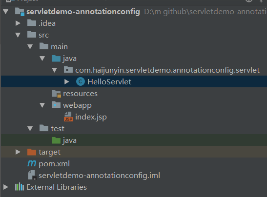
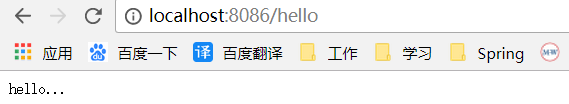

## 构建过程
项目结构如图


pom.xml依赖，导入servlet包
```xml
<?xml version="1.0" encoding="UTF-8"?>
<project xmlns="http://maven.apache.org/POM/4.0.0"
         xmlns:xsi="http://www.w3.org/2001/XMLSchema-instance"
         xsi:schemaLocation="http://maven.apache.org/POM/4.0.0 http://maven.apache.org/xsd/maven-4.0.0.xsd">
    <modelVersion>4.0.0</modelVersion>

    <groupId>com.haijunyin</groupId>
    <artifactId>servletdemo-xmlconfig</artifactId>
    <version>1.0-SNAPSHOT</version>

    <packaging>war</packaging>

    <dependencies>
        <dependency>
            <groupId>javax.servlet</groupId>
            <artifactId>javax.servlet-api</artifactId>
            <version>3.1.0</version>
        </dependency>
    </dependencies>

</project>
```
HelloServlet.java继承HttpServlet，添加注解@WebServlet及url替代xml文件中的映射
```java
package com.haijunyin.servletdemo.xmlconfig.servlet;

import javax.servlet.ServletException;
import javax.servlet.annotation.WebServlet;
import javax.servlet.http.HttpServlet;
import javax.servlet.http.HttpServletRequest;
import javax.servlet.http.HttpServletResponse;
import java.io.IOException;

@WebServlet("/hello")
public class HelloServlet extends HttpServlet {

    @Override
    protected void doGet(HttpServletRequest req, HttpServletResponse resp) throws ServletException, IOException {
        System.out.println("HelloServlet...doGet...");
        resp.getWriter().write("hello...");
    }
}
```
index.jsp请求页
```html
<%@ page language="java" contentType="text/html; charset=utf-8"
         pageEncoding="utf-8"%>
<!DOCTYPE html PUBLIC "-//W3C//DTD HTML 4.01 Transitional//EN" "http://www.w3.org/TR/html4/loose.dtd">
<html>
    <head></head>
    <body>
        <a href="/hello">hello</a>
    </body>
</html>
```
## 运行结果
把应用加入tomcat启动



