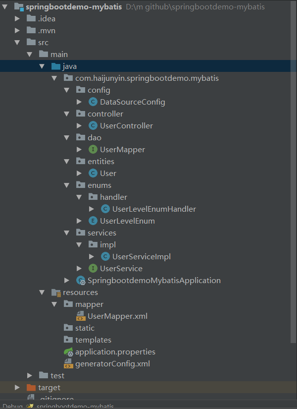
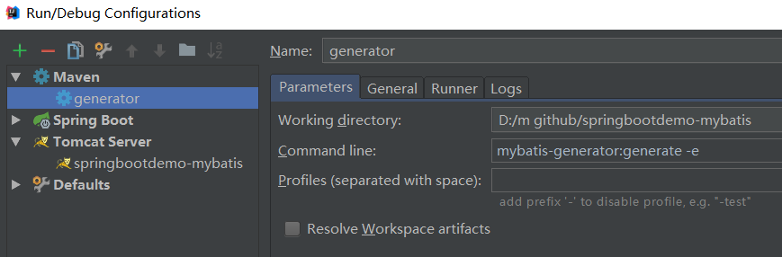

本篇文章用一个简单的demo介绍了mybatis在springboot中如何配置使用，包括自动生成实体类和mapper文件，还有枚举类的处理，在创建demo之前需要在mysql中创建一个user表做演示用
```sql
CREATE TABLE `user` (
  `id` bigint(20) NOT NULL AUTO_INCREMENT COMMENT '主键',
  `name` varchar(20) DEFAULT NULL COMMENT '姓名',
  `age` int(3) DEFAULT NULL COMMENT '年龄',
  `user_level` int(2) DEFAULT NULL COMMENT '用户级别',
  `social_price_amount` decimal(16,4) DEFAULT NULL COMMENT '身价',
  `created_time` datetime DEFAULT NULL COMMENT '创建时间',
  `update_time` datetime DEFAULT NULL COMMENT '修改时间',
  PRIMARY KEY (`id`)
) ENGINE=InnoDB AUTO_INCREMENT=2 DEFAULT CHARSET=utf8 COMMENT='用户表';

```
## 构建过程
项目结构如图


pom.xml引入相关包
```xml
<?xml version="1.0" encoding="UTF-8"?>
<project xmlns="http://maven.apache.org/POM/4.0.0" xmlns:xsi="http://www.w3.org/2001/XMLSchema-instance"
    xsi:schemaLocation="http://maven.apache.org/POM/4.0.0 http://maven.apache.org/xsd/maven-4.0.0.xsd">
    <modelVersion>4.0.0</modelVersion>
    <parent>
        <groupId>org.springframework.boot</groupId>
        <artifactId>spring-boot-starter-parent</artifactId>
        <version>2.1.2.RELEASE</version>
        <relativePath/> <!-- lookup parent from repository -->
    </parent>
    <groupId>com.haijunyin</groupId>
    <artifactId>springbootdemo-mybatis</artifactId>
    <version>0.0.1-SNAPSHOT</version>
    <name>springbootdemo-mybatis</name>
    <description>Demo project for Spring Boot</description>

    <packaging>war</packaging>
    <properties>
        <java.version>1.8</java.version>
    </properties>

    <dependencies>
        <dependency>
            <groupId>org.springframework.boot</groupId>
            <artifactId>spring-boot-starter-web</artifactId>
            <!-- 排除内置容器，排除内置容器导出成war包可以让外部容器运行spring-boot项目-->
            <exclusions>
                <exclusion>
                    <groupId>org.springframework.boot</groupId>
                    <artifactId>spring-boot-starter-tomcat</artifactId>
                </exclusion>
            </exclusions>
        </dependency>

        <dependency>
            <groupId>javax.servlet</groupId>
            <artifactId>javax.servlet-api</artifactId>
            <version>4.0.0</version>
            <scope>provided</scope>
        </dependency>

        <dependency>
            <groupId>org.springframework.boot</groupId>
            <artifactId>spring-boot-starter-test</artifactId>
            <scope>test</scope>
        </dependency>

        <!-- dal -->
        <dependency>
            <groupId>mysql</groupId>
            <artifactId>mysql-connector-java</artifactId>
            <scope>runtime</scope>
        </dependency>
        <dependency>
            <groupId>com.alibaba</groupId>
            <artifactId>druid</artifactId>
            <version>1.1.0</version>
        </dependency>

        <dependency>
            <groupId>org.springframework.boot</groupId>
            <artifactId>spring-boot-starter-data-jpa</artifactId>
        </dependency>
        <dependency>
            <groupId>org.mybatis.spring.boot</groupId>
            <artifactId>mybatis-spring-boot-starter</artifactId>
            <version>1.3.2</version>
        </dependency>
    </dependencies>

    <build>
        <plugins>
            <!-- mybatis自动生成代码插件 -->
            <plugin>
                <groupId>org.mybatis.generator</groupId>
                <artifactId>mybatis-generator-maven-plugin</artifactId>
                <version>1.3.2</version>
                <configuration>
                    <verbose>true</verbose>
                    <overwrite>true</overwrite>
                </configuration>
            </plugin>
            <plugin>
                <groupId>org.springframework.boot</groupId>
                <artifactId>spring-boot-maven-plugin</artifactId>
            </plugin>
        </plugins>
    </build>

</project>
```
SpringbootdemoMybatisApplication.java
```java
package com.haijunyin.springbootdemo.mybatis;

import org.springframework.boot.autoconfigure.SpringBootApplication;
import org.springframework.boot.autoconfigure.jdbc.DataSourceAutoConfiguration;
import org.springframework.boot.builder.SpringApplicationBuilder;
import org.springframework.boot.web.servlet.support.SpringBootServletInitializer;
import org.springframework.context.annotation.ComponentScan;
import org.springframework.scheduling.annotation.EnableAsync;

/**
 * 继承SpringBootServletInitializer，因为继承SpringBootServletInitializer是继承WebApplicationInitializer的，而servlet容器启动的时候
 * 会将WebApplicationInitializer相关的所有子类实例化(这也是servlet3.0以上的版本提供支持)，所以我们还需要在pom.xml
 * 文件中导入servlet3.0及以上的版本
 */
@ComponentScan(basePackages = "com.haijunyin.springbootdemo.mybatis")
@SpringBootApplication(exclude = {DataSourceAutoConfiguration.class})
@EnableAsync
public class SpringbootdemoMybatisApplication extends SpringBootServletInitializer {

    @Override
    protected SpringApplicationBuilder configure(SpringApplicationBuilder applicationBuilder) {
        return applicationBuilder.sources(SpringbootdemoMybatisApplication.class);
    }

//  public static void main(String[] args) {
//      SpringApplication.run(SpringbootdemoMybatisApplication.class, args);
//  }

}

```
generatorConfig.xml自动生成代码插件配置
```xml
<?xml version="1.0" encoding="UTF-8"?>
<!DOCTYPE generatorConfiguration

        PUBLIC "-//mybatis.org//DTD MyBatis Generator Configuration 1.0//EN"

        "http://mybatis.org/dtd/mybatis-generator-config_1_0.dtd">

<!-- 参考网站http://www.mybatis.org/generator/configreference/columnOverride.html -->

<generatorConfiguration>

    <!-- 指定配置文件位置 -->
    <properties resource="application.properties" />
    <!-- 数据库驱动包 -->
    <classPathEntry location="${classPath}" />
    <context id="mysql" targetRuntime="MyBatis3">

        <!-- 生成的Java文件的编码 -->
        <property name="javaFileEncoding" value="UTF-8" />

        <commentGenerator>
            <property name="suppressAllComments" value="true" />
            <property name="suppressDate" value="true" />
        </commentGenerator>

        <!-- 数据库链接信息 -->
        <jdbcConnection driverClass="${master.datasource.driverClassName}"
                        connectionURL="${master.datasource.url}" userId="${master.datasource.username}" password="${master.datasource.password}">
            <property name="remarkable" value="true"></property>
        </jdbcConnection>

        <javaTypeResolver>
            <property name="forceBigDecimals" value="false" />
        </javaTypeResolver>

        <!-- generate Model -->
        <javaModelGenerator targetPackage="${modelPackage}" targetProject="${targetProject}">
            <!--  for MyBatis3/MyBatis3Simple
            自动为每一个生成的类创建一个构造方法，构造方法包含了所有的field；而不是使用setter；
         -->
            <property name="constructorBased" value="false"/>

            <!-- 在targetPackage的基础上，根据数据库的schema再生成一层package，最终生成的类放在这个package下，默认为false -->
            <property name="enableSubPackages" value="true"/>

            <!-- 设置一个根对象，
                如果设置了这个根对象，那么生成的keyClass或者recordClass会继承这个类；在Table的rootClass属性中可以覆盖该选项
                注意：如果在key class或者record class中有root class相同的属性，MBG就不会重新生成这些属性了，包括：
                    1，属性名相同，类型相同，有相同的getter/setter方法；
             -->
            <!--<property name="rootClass" value="com._520it.mybatis.domain.BaseDomain"/>-->

            <!-- 设置是否在getter方法中，对String类型字段调用trim()方法 -->
            <property name="trimStrings" value="true"/>

        </javaModelGenerator>

        <!-- generate xml -->
        <sqlMapGenerator targetPackage="${sqlMapperPackage}" targetProject=".\">
            <property name="enableSubPackages" value="true" />
        </sqlMapGenerator>

        <!-- generate Mapper -->
        <javaClientGenerator type="XMLMAPPER" targetPackage="${daoMapperPackage}" targetProject="${targetProject}">
            <property name="enableSubPackages" value="true" />
        </javaClientGenerator>

        <table schema=""  tableName="user"
               domainObjectName="User" enableCountByExample="false"
               enableUpdateByExample="false" enableDeleteByExample="false"
               enableSelectByExample="false" selectByExampleQueryId="false"
               enableDeleteByPrimaryKey="false" enableUpdateByPrimaryKey="false">

            <columnOverride column="user_level"
                            javaType="com.haijunyin.springbootdemo.mybatis.enums.UserLevelEnum"
                            jdbcType="INTEGER"
                            typeHandler="com.haijunyin.springbootdemo.mybatis.enums.handler.UserLevelEnumHandler">
                <property name="property" value="userLevel"/>
            </columnOverride>
        </table>


    </context>
</generatorConfiguration>
```
application.properties
```
master.datasource.driverClassName=com.mysql.jdbc.Driver
master.datasource.password=123456
master.datasource.url=jdbc:mysql://localhost:3306/bride?serverTimezone=UTC
master.datasource.username=root

classPath=D:/resp/mysql/mysql-connector-java/5.1.46/mysql-connector-java-5.1.46.jar
modelPackage=com.haijunyin.springbootdemo.mybatis.entities
sqlMapperPackage=src/main/resources/mapper
daoMapperPackage=com.haijunyin.springbootdemo.mybatis.dao
targetProject=src/main/java
```
DataSourceConfig.java用于配置mybatis的数据源
```java
package com.haijunyin.springbootdemo.mybatis.config;

import com.alibaba.druid.pool.DruidDataSource;
import org.apache.ibatis.session.SqlSessionFactory;
import org.mybatis.spring.SqlSessionFactoryBean;
import org.mybatis.spring.annotation.MapperScan;
import org.springframework.beans.factory.annotation.Qualifier;
import org.springframework.beans.factory.annotation.Value;
import org.springframework.context.annotation.Bean;
import org.springframework.context.annotation.Configuration;
import org.springframework.context.annotation.Primary;
import org.springframework.core.io.support.PathMatchingResourcePatternResolver;

import javax.sql.DataSource;

/**
 * MyBatis注解方式配置，代替mybatis.xml
 * @Configuration 定义此类为Spring配置类
 * @MapperScan 是mybatis中用于加载数据层接口的定义，basePackage表示Dao接口位置,sqlSessionFatoryRef表示sql会话
 */
@Configuration
@MapperScan(basePackages = "com.haijunyin.springbootdemo.mybatis",sqlSessionFactoryRef = "masterSqlSessionFactory")
public class DataSourceConfig {

    @Value("${master.datasource.url}")
    private String url;
    @Value("${master.datasource.username}")
    private String user;
    @Value("${master.datasource.password}")
    private String password;
    @Value("${master.datasource.driverClassName}")
    private String driverClass;


//    @Value("${spring.datasource.initialSize}")
//    private int initialSize;
//    @Value("${spring.datasource.minIdle}")
//    private int minIdle;
//    @Value("${spring.datasource.maxActive}")
//    private int maxActive;
//    @Value("${spring.datasource.maxWait}")
//    private int maxWait;
//    @Value("${spring.datasource.validationQuery}")
//    private String validationQuery;
//    @Value("${spring.datasource.testOnBorrow}")
//    private boolean testOnBorrow;
//    @Value("${spring.datasource.testOnReturn}")
//    private boolean testOnReturn;
//    @Value("${spring.datasource.testWhileIdle}")
//    private boolean testWhileIdle;
//    @Value("${spring.datasource.timeBetweenEvictionRunsMillis}")
//    private int timeBetweenEvictionRunsMillis;
//    @Value("${spring.datasource.minEvictableIdleTimeMillis}")
//    private int minEvictableIdleTimeMillis;
//    @Value("${spring.datasource.removeAbandoned}")
//    private boolean removeAbandoned;
//    @Value("${spring.datasource.removeAbandonedTimeout}")
//    private int removeAbandonedTimeout;
//    @Value("${spring.datasource.logAbandoned}")
//    private boolean logAbandoned;
//    @Value("${spring.datasource.filters}")
//    private String filters;
//    @Value("${spring.datasource.poolPreparedStatements}")
//    private boolean poolPreparedStatements;
//    @Value("${spring.datasource.maxPoolPreparedStatementPerConnectionSize}")
//    private int maxPoolPreparedStatementPerConnectionSize;

    /**
     * 数据源
     * 用alibaba的DruidDataSource,需要在pom.xml导入连接池包com.alibaba.druid
     * @return
     */
    @Bean(name="masterDataSource")
    @Primary
    public DataSource masterDataSource(){
        DruidDataSource dataSource = new DruidDataSource();
        dataSource.setDriverClassName(driverClass);
        dataSource.setUrl(url);
        dataSource.setUsername(user);
        dataSource.setPassword(password);

        //其它配置
//        dataSource.setInitialSize(initialSize);
//        dataSource.setMinIdle(minIdle);
//        dataSource.setMaxActive(maxActive);
//        dataSource.setMaxWait(maxWait);
//        dataSource.setTimeBetweenEvictionRunsMillis(timeBetweenEvictionRunsMillis);
//        dataSource.setMinEvictableIdleTimeMillis(minEvictableIdleTimeMillis);
//        dataSource.setValidationQuery(validationQuery);
//        dataSource.setTestWhileIdle(testWhileIdle);
//        dataSource.setTestOnBorrow(testOnBorrow);
//        dataSource.setTestOnReturn(testOnReturn);
//        dataSource.setPoolPreparedStatements(poolPreparedStatements);
//        dataSource.setMaxPoolPreparedStatementPerConnectionSize(maxPoolPreparedStatementPerConnectionSize);
        return dataSource;
    }

    /**
     * session工厂
     * @param masterDataSource
     * @return
     * @throws Exception
     */
    @Bean(name = "masterSqlSessionFactory")
    @Primary
    public SqlSessionFactory masterSqlSessionFactory(@Qualifier("masterDataSource") DataSource masterDataSource)
            throws Exception {
        final SqlSessionFactoryBean sessionFactory = new SqlSessionFactoryBean();
        sessionFactory.setDataSource(masterDataSource);
        sessionFactory.setMapperLocations(new PathMatchingResourcePatternResolver()
                .getResources("classpath:mapper/*.xml"));//mapper.xml文件位置
        return sessionFactory.getObject();
    }
}
```
UserController.java
```java
package com.haijunyin.springbootdemo.mybatis.controller;

import com.haijunyin.springbootdemo.mybatis.entities.User;
import com.haijunyin.springbootdemo.mybatis.services.UserService;
import org.springframework.web.bind.annotation.RequestMapping;
import org.springframework.web.bind.annotation.RequestMethod;
import org.springframework.web.bind.annotation.RequestParam;
import org.springframework.web.bind.annotation.RestController;

import javax.annotation.Resource;

@RestController      //相当于@Controller和@ResponseBody，表示当前是一个controller组件，并且可自动封装请求和相应
public class UserController {

    @Resource
    private UserService myUserService;

    @RequestMapping(value="/getUser", method = RequestMethod.GET)
    public User getCategory(@RequestParam(value="id")long id){
        User user = myUserService.findById(id);
        System.out.println(user);
        return user;
    }
}
```
UserService.java
```java
package com.haijunyin.springbootdemo.mybatis.services;

import com.haijunyin.springbootdemo.mybatis.entities.User;

public interface UserService {

    User findById(long id);

}
```
UserServiceImpl.java
```java
package com.haijunyin.springbootdemo.mybatis.services.impl;

import com.haijunyin.springbootdemo.mybatis.dao.UserMapper;
import com.haijunyin.springbootdemo.mybatis.entities.User;
import com.haijunyin.springbootdemo.mybatis.services.UserService;
import org.springframework.beans.factory.annotation.Autowired;
import org.springframework.stereotype.Service;

@Service(value = "myUserService")   //有重复的userService,用自定义名myUserService,在使用的时候需要用@Resource
public class UserServiceImpl implements UserService {

    @Autowired
    private UserMapper userMapper;

    @Override
    public User findById(long id) {
        return userMapper.selectByPrimaryKey(id);
    }

}
```
UserLevelEnum.java
```java
package com.haijunyin.springbootdemo.mybatis.enums;

public enum UserLevelEnum {

    LEVEL_1(1,"普通会员"),
    LEVEL_2(2,"黄砖贵族"),
    LEVEL_3(3,"超级VIP");

    private int code;
    private String memo;

    UserLevelEnum(int code, String memo){
        this.code = code;
        this.memo = memo;
    }

    public static UserLevelEnum getEnumByCode(int code){
        for (UserLevelEnum userLevelEnum : UserLevelEnum.values()) {
            if(code == userLevelEnum.getCode()){
                return userLevelEnum;
            }
        }
        return null;
    }

    public int getCode() {
        return code;
    }

    public void setCode(int code) {
        this.code = code;
    }

    public String getMemo() {
        return memo;
    }

    public void setMemo(String memo) {
        this.memo = memo;
    }
}
```
UserLevelEnumHandler.java
```java
package com.haijunyin.springbootdemo.mybatis.enums.handler;

import com.haijunyin.springbootdemo.mybatis.enums.UserLevelEnum;
import org.apache.ibatis.type.BaseTypeHandler;
import org.apache.ibatis.type.JdbcType;

import java.sql.CallableStatement;
import java.sql.PreparedStatement;
import java.sql.ResultSet;
import java.sql.SQLException;

/**
 * 用于自动生成mybatis文件时候，对应枚举转换
 */
public class UserLevelEnumHandler extends BaseTypeHandler<UserLevelEnum> {

    /**
     * Java类型 转换为对应的数据库类型
     * @param preparedStatement
     * @param i
     * @param userLevelEnum
     * @param jdbcType
     * @throws SQLException
     */
    @Override
    public void setNonNullParameter(PreparedStatement preparedStatement, int i, UserLevelEnum userLevelEnum, JdbcType jdbcType) throws SQLException {
        preparedStatement.setInt(i, userLevelEnum.getCode());
    }
    /**
     * 数据库类型转换为对应的Java类型
     */
    @Override
    public UserLevelEnum getNullableResult(ResultSet resultSet, String s) throws SQLException {
        int value = resultSet.getInt(s);
        UserLevelEnum userLevelEnum = null;
        if (!resultSet.wasNull()) {
            userLevelEnum = UserLevelEnum.getEnumByCode(value);
        }
        return userLevelEnum;
    }
    /**
     * 数据库类型转换为对应的Java类型
     */
    @Override
    public UserLevelEnum getNullableResult(ResultSet resultSet, int i) throws SQLException {
        int value = resultSet.getInt(i);
        UserLevelEnum userLevelEnum = null;
        if (!resultSet.wasNull()) {
            userLevelEnum = UserLevelEnum.getEnumByCode(value);
        }
        return userLevelEnum;
    }
    /**
     * 数据库类型转换为对应的Java类型
     */
    @Override
    public UserLevelEnum getNullableResult(CallableStatement callableStatement, int i) throws SQLException {
        int value = callableStatement.getInt(i);
        UserLevelEnum userLevelEnum = null;
        if (!callableStatement.wasNull()) {
            userLevelEnum = UserLevelEnum.getEnumByCode(value);
        }
        return userLevelEnum;
    }
}
```
接下来还有User.java、UserMapper.java、UserMapper.xml，这些是由插件生成的，我们需要在idea中配置generatorConfig，如图


配置完成后，运行插件，生成代码
User.java
```java
package com.haijunyin.springbootdemo.mybatis.entities;

import com.haijunyin.springbootdemo.mybatis.enums.UserLevelEnum;
import java.math.BigDecimal;
import java.util.Date;

public class User {
    private Long id;

    private String name;

    private Integer age;

    private UserLevelEnum userLevel;

    private BigDecimal socialPriceAmount;

    private Date createdTime;

    private Date updateTime;

    public Long getId() {
        return id;
    }

    public void setId(Long id) {
        this.id = id;
    }

    public String getName() {
        return name;
    }

    public void setName(String name) {
        this.name = name == null ? null : name.trim();
    }

    public Integer getAge() {
        return age;
    }

    public void setAge(Integer age) {
        this.age = age;
    }

    public UserLevelEnum getUserLevel() {
        return userLevel;
    }

    public void setUserLevel(UserLevelEnum userLevel) {
        this.userLevel = userLevel;
    }

    public BigDecimal getSocialPriceAmount() {
        return socialPriceAmount;
    }

    public void setSocialPriceAmount(BigDecimal socialPriceAmount) {
        this.socialPriceAmount = socialPriceAmount;
    }

    public Date getCreatedTime() {
        return createdTime;
    }

    public void setCreatedTime(Date createdTime) {
        this.createdTime = createdTime;
    }

    public Date getUpdateTime() {
        return updateTime;
    }

    public void setUpdateTime(Date updateTime) {
        this.updateTime = updateTime;
    }
}
```
UserMapper.java
```java
package com.haijunyin.springbootdemo.mybatis.dao;

import com.haijunyin.springbootdemo.mybatis.entities.User;

public interface UserMapper {
    int insert(User record);

    int insertSelective(User record);

    User selectByPrimaryKey(Long id);
}
```
UserMapper.xml
```xml
<?xml version="1.0" encoding="UTF-8" ?>
<!DOCTYPE mapper PUBLIC "-//mybatis.org//DTD Mapper 3.0//EN" "http://mybatis.org/dtd/mybatis-3-mapper.dtd" >
<mapper namespace="com.haijunyin.springbootdemo.mybatis.dao.UserMapper" >
  <resultMap id="BaseResultMap" type="com.haijunyin.springbootdemo.mybatis.entities.User" >
    <id column="id" property="id" jdbcType="BIGINT" />
    <result column="name" property="name" jdbcType="VARCHAR" />
    <result column="age" property="age" jdbcType="INTEGER" />
    <result column="user_level" property="userLevel" jdbcType="INTEGER" typeHandler="com.haijunyin.springbootdemo.mybatis.enums.handler.UserLevelEnumHandler" />
    <result column="social_price_amount" property="socialPriceAmount" jdbcType="DECIMAL" />
    <result column="created_time" property="createdTime" jdbcType="TIMESTAMP" />
    <result column="update_time" property="updateTime" jdbcType="TIMESTAMP" />
  </resultMap>
  <sql id="Base_Column_List" >
    id, name, age, user_level, social_price_amount, created_time, update_time
  </sql>
  <select id="selectByPrimaryKey" resultMap="BaseResultMap" parameterType="java.lang.Long" >
    select 
    <include refid="Base_Column_List" />
    from user
    where id = #{id,jdbcType=BIGINT}
  </select>
  <insert id="insert" parameterType="com.haijunyin.springbootdemo.mybatis.entities.User" >
    insert into user (id, name, age, 
      user_level, 
      social_price_amount, created_time, update_time
      )
    values (#{id,jdbcType=BIGINT}, #{name,jdbcType=VARCHAR}, #{age,jdbcType=INTEGER}, 
      #{userLevel,jdbcType=INTEGER,typeHandler=com.haijunyin.springbootdemo.mybatis.enums.handler.UserLevelEnumHandler}, 
      #{socialPriceAmount,jdbcType=DECIMAL}, #{createdTime,jdbcType=TIMESTAMP}, #{updateTime,jdbcType=TIMESTAMP}
      )
  </insert>
  <insert id="insertSelective" parameterType="com.haijunyin.springbootdemo.mybatis.entities.User" >
    insert into user
    <trim prefix="(" suffix=")" suffixOverrides="," >
      <if test="id != null" >
        id,
      </if>
      <if test="name != null" >
        name,
      </if>
      <if test="age != null" >
        age,
      </if>
      <if test="userLevel != null" >
        user_level,
      </if>
      <if test="socialPriceAmount != null" >
        social_price_amount,
      </if>
      <if test="createdTime != null" >
        created_time,
      </if>
      <if test="updateTime != null" >
        update_time,
      </if>
    </trim>
    <trim prefix="values (" suffix=")" suffixOverrides="," >
      <if test="id != null" >
        #{id,jdbcType=BIGINT},
      </if>
      <if test="name != null" >
        #{name,jdbcType=VARCHAR},
      </if>
      <if test="age != null" >
        #{age,jdbcType=INTEGER},
      </if>
      <if test="userLevel != null" >
        #{userLevel,jdbcType=INTEGER,typeHandler=com.haijunyin.springbootdemo.mybatis.enums.handler.UserLevelEnumHandler},
      </if>
      <if test="socialPriceAmount != null" >
        #{socialPriceAmount,jdbcType=DECIMAL},
      </if>
      <if test="createdTime != null" >
        #{createdTime,jdbcType=TIMESTAMP},
      </if>
      <if test="updateTime != null" >
        #{updateTime,jdbcType=TIMESTAMP},
      </if>
    </trim>
  </insert>
</mapper>
```

## 运行结果
配置tomcat启动运行，在浏览器中输入路径
```
http://localhost:8084/getUser/?id=1
```
返回结果
```
{"id":1,"name":"阿呆","age":33,"userLevel":"LEVEL_2","socialPriceAmount":600000.0000,"createdTime":"2019-01-14T21:37:49.000+0000","updateTime":"2019-01-14T21:37:54.000+0000"}
```
说明myBatis配置成功

## 总结
关于myBatis的插件generatorConfig更多配置可以参考文档 [MyBatis的generatorConfig文档](http://www.mybatis.org/generator/configreference/columnOverride.html)，里面有详细的说明
