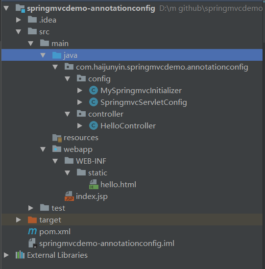
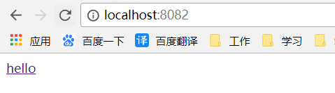

## 构建过程
项目结构如图


pom.xml，添加springmvc相关依赖
```xml
<?xml version="1.0" encoding="UTF-8"?>
<project xmlns="http://maven.apache.org/POM/4.0.0"
         xmlns:xsi="http://www.w3.org/2001/XMLSchema-instance"
         xsi:schemaLocation="http://maven.apache.org/POM/4.0.0 http://maven.apache.org/xsd/maven-4.0.0.xsd">
    <modelVersion>4.0.0</modelVersion>

    <groupId>com.haijunyin</groupId>
    <artifactId>springmvcdemo-xmlconfig</artifactId>
    <version>1.0-SNAPSHOT</version>

    <packaging>war</packaging>

    <dependencies>
        <dependency>
            <groupId>org.springframework</groupId>
            <artifactId>spring-web</artifactId>
            <version>4.3.8.RELEASE</version>
        </dependency>
        <dependency>
            <groupId>org.springframework</groupId>
            <artifactId>spring-webmvc</artifactId>
            <version>4.3.8.RELEASE</version>
        </dependency>
        <dependency>
            <groupId>javax.servlet</groupId>
            <artifactId>javax.servlet-api</artifactId>
            <version>3.1.0</version>
        </dependency>
    </dependencies>
</project>
```
HelloController.class
```java
package com.haijunyin.springmvcdemo.xmlconfig.controller;

import org.springframework.stereotype.Controller;
import org.springframework.web.bind.annotation.RequestMapping;
import org.springframework.web.bind.annotation.RequestMethod;
import org.springframework.web.bind.annotation.RequestParam;

import javax.servlet.ServletException;
import javax.servlet.http.HttpServletResponse;
import java.io.IOException;

@Controller
@RequestMapping("/hello")
public class HelloController {

    //返回String类型代表页面跳转
    @RequestMapping(value = "/ref",method = RequestMethod.GET)
    public String refHello(){
        System.out.println("HelloController...refHello...");
        return "hello";
    }

    //使用RequestParam注解直接获取值
    @RequestMapping(value = "/show",method = RequestMethod.POST)
    public void showHello(@RequestParam(value = "name")String name, HttpServletResponse resp) throws ServletException, IOException {
        System.out.println("ShowHelloServlet...doPost...");
        //获取值，并设置编码
        System.out.println("name=" + name);
        //输出，解决浏览器乱码问题
        resp.setHeader("Content-type", "text/html;charset=UTF-8");
        resp.setCharacterEncoding("UTF-8");
        resp.getWriter().write("我很好，你呢？");
        System.out.println("输出...");
    }

}
```
index.jsp
```html
<%@ page language="java" contentType="text/html; charset=utf-8"
         pageEncoding="utf-8"%>
<!DOCTYPE html PUBLIC "-//W3C//DTD HTML 4.01 Transitional//EN" "http://www.w3.org/TR/html4/loose.dtd">
<html>
    <head></head>
    <body>
        <a href="/hello/ref">hello</a>
    </body>
</html>
```
MySpringmvcInitializer.class，相当于xml中的web.xml
```java
package com.haijunyin.springmvcdemo.annotationconfig.config;

import org.springframework.web.servlet.support.AbstractAnnotationConfigDispatcherServletInitializer;

/**
 * SpringMVC初始化器，用于替代web.xml中的spring相关配置
 * 该类是WebApplicationInitializer的子类，spring工程在初始化的时候会实例化其所有子类
 */
public class MySpringmvcInitializer extends AbstractAnnotationConfigDispatcherServletInitializer {

    protected Class<?>[] getRootConfigClasses() {
        return new Class[0];
    }

    //引入配置类
    protected Class<?>[] getServletConfigClasses() {
        return new Class[]{SpringmvcServletConfig.class};
    }

    //mapping映射
    protected String[] getServletMappings() {
        return new String[]{"/"};
    }

}

```
SpringmvcServletConfig.cass，相当于springmvc-servlet.xml
```java
package com.haijunyin.springmvcdemo.annotationconfig.config;

import org.springframework.context.annotation.Bean;
import org.springframework.context.annotation.ComponentScan;
import org.springframework.context.annotation.Configuration;
import org.springframework.web.servlet.ViewResolver;
import org.springframework.web.servlet.config.annotation.*;
import org.springframework.web.servlet.view.InternalResourceViewResolver;

/**
 * 替代springmvc-servlet.xml文件
 */
@Configuration
@EnableWebMvc
@ComponentScan(value = "com.haijunyin.springmvcdemo")
public class SpringmvcServletConfig extends WebMvcConfigurerAdapter {

    /** 初始化视图解析器 **/
    @Bean
    public ViewResolver getViewResolver(){
        InternalResourceViewResolver viewResolver = new InternalResourceViewResolver();
        viewResolver.setPrefix("/WEB-INF/static/");
        viewResolver.setSuffix(".html");
        return viewResolver;
    }

    /** 默认静态资源处理器 **/
    @Override
    public void configureDefaultServletHandling(DefaultServletHandlerConfigurer configurer) {
        configurer.enable();
    }

    /** 静态资源处理 **/
    @Override
    public void addResourceHandlers(ResourceHandlerRegistry registry) {
        super.addResourceHandlers(registry);
    }

    /** 其它常用方法 */
//    /** 解决跨域问题 **/
//    public void addCorsMappings(CorsRegistry registry) ;
//    /** 添加拦截器 **/
//    void addInterceptors(InterceptorRegistry registry);
//    /** 这里配置视图解析器 **/
//    void configureViewResolvers(ViewResolverRegistry registry);
//    /** 配置内容裁决的一些选项 **/
//    void configureContentNegotiation(ContentNegotiationConfigurer configurer);
//    /** 视图跳转控制器 **/
//    void addViewControllers(ViewControllerRegistry registry);

}

```
## 运行结果
项目构建完成后启动tomcat


