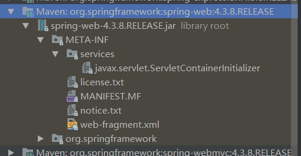

## 启动
#### servlet
Servlet的shared libraries（共享库）/runtimes pluggability（运行时插件能力）：  
Servlet容器在启动应用的时候会扫描，当前应用里面每一个jar包的META-INFO/services/javax.servlet.ServletContainerInitalizer指定的实现类，运行这个实现类的启动方法。
#### springmvc的ServletContainerInitalizer


图中是spring-web的ServletContainerInitalizer文件，里面的代码只有一行
```
org.springframework.web.SpringServletContainerInitializer
```
SpringServletContainerInitializer就是spring的初始化容器类，该类实现了ServletContainerInitializer接口，并且用HandlesTypes注解引入Web的启动类WebApplicationInitializer，WebApplicationInitializer是一个接口，其子类AbstractDispatcherServletInitializer将springmvc需要的各种实例以及DispatcherServlet实例

## 请求处理过程
参考博文https://www.cnblogs.com/xiaoxi/p/6164383.html