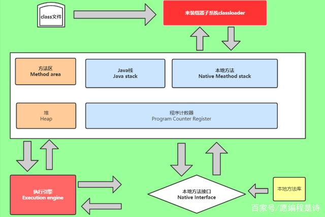

### JVM内存模型

​	JVM实例对应了一个独立运行的java程序——进程级别，一个运行时的Java虚拟机负责运行一个java程序，当启动一个Java程序时，一个虚拟机实例诞生；当程序关闭退出，这个虚拟机实例也就随之消亡。如果在一个计算机中同时运行多个Java程序，将得到多个Java虚拟机实例，每个Java程序都运行于它自己的Java虚拟机实例中

​	JVM执行引擎实例则对应了属于运行程序的线程——线程级别




### 类加载过程（类的生命周期）

#### 1、加载

​	通过类全名来获取定义此类的二进制字节流

​	将字节流所代表的静态存储结构转换为方法区的运行时数据结构

​	在Java堆中生成一个代表这个类的Class对象，作为方法区这些数据的访问入口

##### 双亲委派机制

​	当某个类加载器需要加载某个.class文件时，它首先把这个任务委派给它的上级类加载器，递归这个操作，如果上级的类加载器没有加载，自己才会加载这个类

###### 类加载器的级别

​	BootstrapClassLoader(启动类加载器)

​	c++编写，加载java核心库java.*，构造ExtClassLoader和AppClassLoader，由于引导类加载器设计到虚拟机本地实现细节，开发者无法直接获取到启动类加载器的引用，所以不允许直接通过引用进行操作

​	ExtClassLoader(标准扩展类加载器)

​	java编写，加载扩展库，如classpath中的jre，javax.*或者java.ext.dir指定位置中的类，开发者可直接使用

​	CustomClassLoader(用户自定义类加载器)

​	java编写，可加载指定路径的class文件

```java
        System.out.println(new TryClassLoaderDemo().getClass().getClassLoader().getParent().getParent());//BootstrapClassLoader
        System.out.println(new TryClassLoaderDemo().getClass().getClassLoader().getParent());//ExtClassLoader
        System.out.println(new TryClassLoaderDemo().getClass().getClassLoader());//AppCLassLoader

        //Object类是rt.jar包下的类，rt.jar包由BootstarpClassLoader加载，所以这里打印null
        System.out.println(new Object().getClass().getClassLoader());//BootstarpClassLoader
```

结果输出

```java
null
jdk.internal.loader.ClassLoaders$PlatformClassLoader@5fd0d5ae
jdk.internal.loader.ClassLoaders$AppClassLoader@78308db1
null
```

###### 作用

​	防止重复加载同一个.class，通过委托向上面问一问，加载过了，就不用再加载一遍，保证数据安全

​	保证核心.class不能被篡改，通过委托方式，不会去篡改核心.class，即便可以写，也是不会被加载的，比如我们可以写一个自定义的java.lang.String，想想它会被加载吗，当然不会，因为自己写的类是由用户自定义类加载器加载，而加载顺序是从上往下，此时核心库里的java.lang.String已经被加载，所以自定义的String不会被加载

#### 2、验证

验证是链接安全的第一步，这一步主要目的是确保class文件的字节流中包含的信息符合当前虚拟机的要求，并且不会危害虚拟机自身

#### 3、准备

准备阶段是正式为类变量分配内存并设置类变量初始值的阶段，这些内存都将在方法区中进行分配。这个阶段有两个容易产生混淆的知识点，首先是这个时候进行内存分配的仅包括类变量（static修饰的变量），而不包括实例变量，实例变量将会在对象实例化时随着对象一起分配在java堆中。其次是这里所说的初始化“通常情况”下是数据类型的零值，假设一个类变量定义为:

public static int value  = 12;

那么变量value在准备阶段过后的初始值为0而不是12，因为这时候尚未开始执行任何java方法，而把value赋值为123的putstatic指令是程序被编译后，存放于类构造器<clinit>()方法之中，所以把value赋值为12的动作将在初始化阶段才会被执行。

上面所说的“通常情况”下初始值是零值，那相对于一些特殊的情况，如果类字段的字段属性表中存在ConstantValue属性，那在准备阶段变量value就会被初始化为ConstantValue属性所指定的值，建设上面类变量value定义为：

public static final int value = 123;

编译时javac将会为value生成ConstantValue属性，在准备阶段虚拟机就会根据ConstantValue的设置将value设置为123。

#### 4、解析

解析阶段是虚拟机常量池内的符号引用替换为直接引用的过程

符号引用：符号引用是一组符号来描述所引用的目标对象，符号可以是任何形式的字面量，只要使用时能无歧义地定位到目标即可。符号引用与虚拟机实现的内存布局无关，引用的目标对象并不一定已经加装到内存中

直接引用：直接引用可以是直接指向目标对象的指针、相对偏移量或是一个能间接定位到目标的句柄。直接引用是与虚拟机内存布局相关的，同一个符号引用在不同虚拟机实例上翻译出来的直接引用一般不会相同，如果有了直接引用，那引用的目标必定已经在内存中存在

解析的动作主要针对类、接口、字段、类方法、接口方法四类符号引用进行。分别对应编译后常量池内的CONSTANT_Class_Info、CONSTANT_Fieldref_Info、CONSTANT_Methodef_Info、CONSTANT_InterfaceMethoder_Info四种常量类型

#### 5、初始化

​	类加载的最后阶段，若该类具有超类，则对其进行初始化，执行静态初始化器和静态初始化成员变量（如前面只初始化了默认值的static变量将会在这个阶段赋值，成员变量也将会被初始化）。

### 运行时数据区

​	JVM运行时会分配好方法区和堆，而JVM每遇到一个线程，就为其分配一个程序计数器、Java栈、本地方法栈，当线程终止时，三者所占用的空间会被释放

程序计数器、Java栈、本地方法栈的生命周期与所属线程相同，而方法区和堆的生命周期与Java程序运行的生命周期相同，所以gc只发生在共享的区域（大部分发生在Heap上）

#### 1、方法区

​	在方法区中存储了每个类的信息（类的名称、修饰符、方法信息、字段信息）、类中静态变量、类中定义为final类型的常量、类中的Field信息、类中的方法信息以及编译器编译后的代码等。当开发人员在程序中通过Class对象中的getName、isInterface等方法来获取信息时，这些数据都来源于方法区域，同时方法区域也是全局共享的，在一定的条件下它也会被GC，在这里进行的GC主要是方法区里的常量池和类型的卸载。当方法区域需要使用的内存超过其允许的大小时，会抛出OutOfMemory的错误信息。
​	在方法区中有一个非常重要的部分就是运行时常量池，用于存放静态编译产生的字面量和符号引用。运行时生成的常量也会存在这个常量池中

#### 3、堆

​	Java中的堆是用来存储对象实例及数组（当然，数组引用是存在Java栈中的）。堆是被所有线程共享的，因此在其上进行对象内存的分配均需要进行加锁，这也导致了new对象的开销是比较大的。在JVM中只有一个堆，堆是垃圾回收器主要区域

​	堆空间分为老年代和年轻代。刚创建的对象存放在年轻代，而老年代中存放生命周期长久的实例对象。年轻代中又被分为Eden区和两个Survivor区(From Space和To Space)。新的对象分配是首先放在Eden区，Survivor区作为Eden区和Old区的缓冲，在Survivor区的对象经历若干次GC仍然存活的，就会被转移到老年代。 当一个对象大于eden区而小于old区（老年代）的时候会直接扔到old区。 而当对象大于old区时，会直接抛出OutOfMemoryError（OOM）。

#### 4、Java栈

Java栈也称作虚拟机栈（Java Vitual Machine Stack），也就是我们常常所说的栈。JVM栈是线程私有的，每个线程创建的同时都会创建自己的JVM栈，互不干扰。

Java栈是Java方法执行的内存模型。Java栈中存放的是一个个的栈帧，每个栈帧对应一个被调用的方法，在栈帧中包括局部变量表(Local Variables)、操作数栈(Operand Stack)、指向当前方法所属的类的运行时常量池的引用(Reference to runtime constant pool)、方法返回地址(Return Address)和一些额外的附加信息。当线程执行一个方法时，就会随之创建一个对应的栈帧，并将建立的栈帧压栈。当方法执行完毕之后，便会将栈帧出栈。因此可知，线程当前执行的方法所对应的栈帧必定位于Java栈的顶部。

局部变量表：用来存储方法中的局部变量（包括在方法中声明的非静态变量以及函数形参）。对于基本数据类型的变量，则直接存储它的值，对于引用类型的变量，则存的是指向对象的引用。局部变量表的大小在编译期就可以确定其大小了，因此在程序执行期间局部变量表的大小是不会改变的。

操作数栈：栈最典型的一个应用就是用来对表达式求值。在一个线程执行方法的过程中，实际上就是不断执行语句的过程，而归根到底就是进行计算的过程。因此可以这么说，程序中的所有计算过程都是在借助于操作数栈来完成的。

指向运行时常量池的引用：因为在方法执行的过程中有可能需要用到类中的常量，所以必须要有一个引用指向运行时常量。

#### 5、程序计数器

程序计数器（Program Counter Register），也有称作为PC寄存器。

由于在JVM中，多线程是通过线程轮流切换来获得CPU执行时间的，因此，在任一具体时刻，一个CPU的内核只会执行一条线程中的指令，因此，为了能够使得每个线程都在线程切换后能够恢复在切换之前的程序执行位置，每个线程都需要有自己独立的程序计数器，并且不能互相被干扰，否则就会影响到程序的正常执行次序。因此，可以这么说，程序计数器是每个线程所私有的。

在JVM规范中规定，如果线程执行的是非native（本地）方法，则程序计数器中保存的是当前需要执行的指令的地址；如果线程执行的是native方法，则程序计数器中的值是undefined。

由于程序计数器中存储的数据所占空间的大小不会随程序的执行而发生改变，因此，对于程序计数器是不会发生内存溢出现象(OutOfMemory)的。

#### 6、本地方法栈：

JVM采用本地方法堆栈来支持native方法的执行，此区域用于存储每个native方法调用的状态。本地方法栈与Java栈的作用和原理非常相似。区别只不过是Java栈是为执行Java方法服务的，而本地方法栈则是为执行本地方法（Native Method）服务的。在JVM规范中，并没有对本地方法栈的具体实现方法以及数据结构作强制规定，虚拟机可以自由实现它。在HotSopt虚拟机中直接就把本地方法栈和Java栈合二为一。

### JVM垃圾回收机制

GC的基本原理：将内存中不再被使用的对象进行回收，GC中用于回收的方法称为收集器，由于GC需要消耗一些资源和时间，Java在对对象的生命周期特征进行分析后，按照新生代、老年代的方式来对对象进行收集，以尽可能缩短GC对应用造成的暂停，堆和方法区是需要被回收的

#### 强引用、软引用、弱引用、虚引用

强引用：平时最常用的，在内存不足的情况GC也不会回收，抛出OOM

软引用SoftReference：在内存不足情况下被回收，避免OOM

弱引用WeakReference：有GC执行时会被回收

虚引用PhantomReference：与ReferenceQueue一起使用，get()的值一直是null

#### 垃圾回收算法

##### 标记-清除

优点：节省空间

缺点：会产生大量不连续的碎片，空间碎片太多可能会导致：程序以后运行中分配大对象时无法找到足够的连续内存而不得不提前引发另一次垃圾回收

##### 复制

将使用内存按容量划分为大小相等的两块，每次只使用其中一块，当一块用完了将存活对象复制到另一块，然后把自己清除掉

优点：效率受存活对象影响，存活对象越多效率越低

缺点：需要大量的内存空间

##### 标记-整理

在标记后，不直接清除，而是将存活对象移动到一端后，再清理

优点：避免了内存碎片产生

##### 分代收集

分代收集算法是目前大部分JVM的垃圾回收算法。它的核心思想是根据对象存活的生命周期将内存划分为若干个不同的区域。一般将堆分为新生代和老年代，堆外还有一个叫永久代（有的也叫元空间，1.8以后就把之前的永久代和方法区合并为元空间了）

1、新生代的回收算法

​	采用标记-复制算法，所有新生成的对象都是放在新生代的。新生代的目标是尽可能快地回收那些生命周期短的对象。分为三个区，一个Eden区、两个Survivor区，大部分对象在Eden区生成，当Eden区满的时候，还存活的对象将被复制到Survivor区（两个中的一个），当这个Survivor区满时，此区的存活对象将被复制到另外一个Survivor区，当另一个Survivor区也满的时候，从第一个Survivor区复制过来的并且此时还存活的对象将被复制到老年代，熬过十次以上的回收也会放入老年代，需要注意，Survivor的两个区是对称的，没有先后关系，所以同一个区中可能同时存在从Eden复制过来以及从另一个Survivor区复制过来的对象，而复制到老年区的只有从第一个Survivor区过来的对象，且Survivor总有一个是空的

2、老年代的回收算法

老年代的特点是每次回收都只回收少量对象，一般使用的是Mark-Compact（标记-整理）算法。

a）在年轻代中经历了N次垃圾回收后仍然存活的对象，就会被放到年老代中。因此，可以认为年老代中存放的都是一些生命周期较长的对象。

b）内存比新生代也大很多(大概比例是1:2)，当老年代内存满时触发Major GC或Full GC，Full GC发生频率比较低，老年代对象存活时间比较长，存活率标记高。
3、永久代的回收算法

​	jdk1.8以后之前的永久代和方法区合并为元空间，

#### 常见的垃圾回收器

##### Serial

新生代单线程收集器，标记和整理都是单线程，优点是简单高效。单线程方面意味着它只会使用一个CPU或一条线程去完成垃圾回收工作，另一方面也意味着它进行垃圾收集器时必须暂停其它线程，直到它收集结束为止。是Client级别默认的GC方式，可以通过-XX:+UserSerialGC来强制指定

说明：需要STW(Stop The World)，停顿时间长，简单高效，对于单个CPU环境而言，有较高效率

##### Serial Old

老年代单线程收集器，Serial收集器的老年代版本

##### ParNew

新生代收集器，可以认为是Serial的多线程版本，使用多个线程进行垃圾收集，在多核CPU环境下有着比Serial更好的表现，是Server模式下的虚拟机首选，其中一个很重要的和性能无关的原因是，除了Serial收集器外，目前只有它能和CMS收集器配合工作，它默认开启的收集器线程数与CPU核数相同，在CPU数量非常多的情况下，可以使用-XX:ParallelGCThreads参数来限制垃圾回收的线程数

##### Parallel Scavenge

Parallel Scavenge是一个新生代的多线程收集器，它在回收期间不需要暂停其他用户线程，其采用的是复制算法，它追求高吞吐量，高效利用CPU，主要是为了达到一个可控的吞吐量，Parallel Scavenge是虚拟机运行在Server摸索下默认垃圾回收器。

适合后台应用等对交互相应要求不高的场景。是server级别默认采用的GC方式，可用-XX:+UseParallelGC来强制指定，用-XX:ParallelGCThreads=4来指定线程数。

##### Parallel Old

是Parallel Scavenge的老年代版本

##### CMS

CMS是一种以获取最短回收停顿时间为目标的收集器，它是一种并发收集器，采用的是标记-清除算法，高并发、低停顿，CPU占用比较高，相应时间快，停顿时间短，多核CPU追求高响应时间的选择

收集过程：

​	1）、初始标记，标记GCRoots能直接管理到的对象，时间很短

​	2）、并发标记，进行GCRoots Tracing（可达性分析）过程，时间很长

​	3）、重新标记，修正并发标记期间因用户程序继续运作而导致标记产生变动的那一部分对象的标记记录，时间较长

​	4）、并发清除，回收内存空间，时间很长

其中，并发标记和并发清除的时间最长，但是可以和用户线程并行工作

说明：1）对CPU资源非常敏感，可能会导致应用程序变慢，吞吐量下降。2）无法处理浮动垃圾，因为在并发清理阶段用户线程还在运行，自然会产生新的垃圾，因此在此次收集中是无法收集它们，只能留到下次收集，同时，由于用户线程并发执行，所有需要预留一部分老年代空间提供并发收集时的程序使用。3）由于采用标记-清除算法，会产生大量的内存碎片，不利于大对象的分配，可能会提前除法Full GC

##### G1

G1收集器是当今收集器技术发展最前沿的成果，它是一款面向服务端应用的收集器。它能充分利用CPU、多核环境，因此它是一款并行与并发的收集器，并且它能建立可预测的停顿时间模型

特点：

​	1）、并行和并发，使用多个CPU来缩短Stop The World停顿时间，与用户线程并发执行

​	2）、分代收集，独立管理整个堆，但是能够采用不同的方式去处理新对象和已经存活了多次的对象，

​	3）、空间整合，基于标记-整理算法，无内存碎片

​	4）、可预测的停顿，能建立可预测停顿时间模型，能让使用者明确地指定一个长度为M毫秒的时间片段内，消耗在垃圾收集器上的时间不得超过N毫秒，

使用G1收集器时，Java上的内存布局与其他收集器有很多差别，他将整个Java堆划分为多个大小相等的独立区域（Region），虽然还保留有新生代和老年代的概念，但是它们都是一部分（可以不连续）的Region集合

#### Minor GC、Full GC触发条件

1、Minor GC触发条件

Eden区域满了，或者新创建的对象大小大于Eden剩余空间

CMS设置了CMSScavengeBeforeRemark参数，这样在CMS的Remark之前会先做一次Minor GC来清理新生代，以加速之后的Remark速度，这样整体的STW时间反而会短

Full GC的时候会先触发Minor GC

2、Full GC触发条件

Minor GC后存活的对象晋升到老年代时由于悲观策略的原因，有两种情况会触发Full GC，一种是之前每次晋升的对象的平均大小 >大于老年代的剩余空间；一种是Minor GC后存活的对象超过了老年代的剩余空间。这两种情况都是因为老年代会为新生代对象的晋升提供担保，而每次晋升的对象的大小是无法预测的，所以只能基于统计，一个是基于历史平均水平，一个是基于下一次可能要晋升的最大水平

CMS失败，发生concurrent model failure会引起Full GC，这种情况下会使用Serial Old收集器，是单线程的，对GC影响很大。concurrent model failure产生的原因是老年代剩余空间不够，导致了GC线程并发执行的用户线程创建的大对象不能进入老年代，只有STW来暂停用户线程，执行GC清理，可以通过设置CMSInitiatingOccupancyFraction预留合适的CMS执行时剩余的空间

新生代直接晋升老年代的大对象超过了老年代的剩余空间，引发Full GC，注意与promotion failure的区别，promotion failure指的是Minor GC后发生的担保失败

Perm永久代空间不足会引发Full GC，可以让CMS永久代空间，设置CMSClassUnloadingEnabled即可

System.gc()引发Full GC，可以设置DisableExplicitGC来禁止调用System.gc引发Full GC

