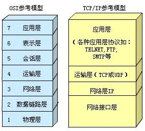

## TCP/IP协议分层

### 应用层

向用户提供一组常用的应用程序，比如电子邮件、文件传输访问、远程登录等。

### 传输层

提供应用程序间的通信。其功能包括：格式化信息流、提供可靠传输。为实现后者，传输层协议规定接受者必须发回确认，并且加入分组丢失，必须重新发送

### 网络层

负责相邻计算机之间的通信。其功能包括三方面

处理来自传输层的分组发送请求，收到请求后，将分组装入IP数据报，填充报头，选择去往信宿机的路径，然后将数据报发往适当的网络接口

处理输入数据报：首先检查其合法性，然后进行寻径--加入该数据报已到达信宿机，则去掉报头，将剩下部分交给适当的传输协议；假如该数据报尚未到达信宿，则转发该数据报。

三、处理路径、流控、拥塞等问题。

### 网络接口层

这是TCP/IP软件的最低层，负责接收IP数据报并通过网络发送之，或者从网络上接收物理帧，抽出IP数据报，交给IP层。

## TCP三次握手和四次挥手

第一次握手：客户端发送SYN包(seq=x)到服务器，并进入SYN_SEND状态，等待服务器确认

第二次握手：服务器收到SYN包，必须确认客户端ACK(ack=x+1)，同时自己也发送一个syn包(seq=y)，服务器进入SYN_RECV状态

第三次握手：客户端收到服务器的Syn+Ack包，向服务器发送确认包Ack(ack=y+1)，此包发送完毕，客户端和服务器进入ESTABLISHED状态，完成三次握手

第一次挥手：主动关闭方发送一个FIN，用来关闭主动方到被动方的数据传送

第二次挥手：被动关闭方收到FIN包后，发送一个ACK给对方，确认序号为收到序号+1

第三次挥手：被动关闭方发送一个FIN，用来关闭被动关闭方到主动关闭方的数据传送

第四次挥手：主动关闭方收到FIN后，发送一个ACK给被动关闭方，确认序号为收到序号+1，至此，完成四次挥手

