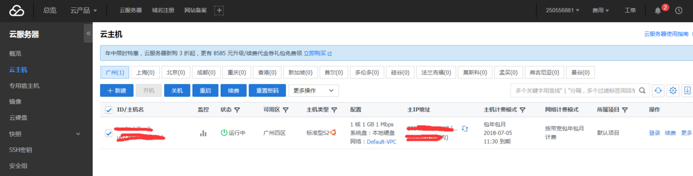

## 准备工作
1.申请腾讯云服务器
可以用QQ、微信申请一个试用15天的，登陆进入如图

2.重置密码
点击重置密码进行重置密码操作，然后重启服务器

ubuntu系统安装jdk
sudo apt-get update
sudo apt-get install openjdk-8-jdk

tomcat
sudo apt-get install tomcat8

sudo /etc/init.d/tomcat8 restart  启动

cd /var/lib/tomcat8/webapps 应用目录

sudo apt install lrzsz 安装上传下载插件

sudo sz xx.war  这里一定要加sudo，否则无权上传，（这玩意儿搞了好阵子才弄明白）