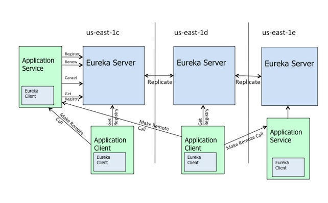

在Eureka是springclould中用来做服务发现的，类似于dubbo+zookeeper的组合，[演示项目地址](https://github.com/haijunY/demo-eureka.git)

## 快速理解

首先来看一张图



### Eureka Server 与 Eureka Client

Eureka Server表示当前是一个服务应用，相当于dubbo架构的zookeeper，代码中用@EnableEurekaServer表示

```java
@EnableEurekaServer //声明一个注册中心
@SpringBootApplication
public class DemoEurekaserverApplication {
    public static void main(String[] args) {
        SpringApplication.run(DemoEurekaserverApplication.class, args);
    }
}
```

Eureka Client表示当前是一个客户端应用，相当于dubbo架构中的consumer和provider，代码中用@EnableEurekaClient表示

```java
@EnableDiscoveryClient //或者@EnableEurekaClient
/*
1，@EnableDiscoveryClient注解是基于spring-cloud-commons依赖，并且在classpath中实现；
2，@EnableEurekaClient注解是基于spring-cloud-netflix依赖，只能为eureka作用；
如果你的classpath中添加了eureka，则它们的作用是一样的。
 */
@SpringBootApplication
public class DemoEurekaproviderApplication {

    public static void main(String[] args) {
        SpringApplication.run(DemoEurekaproviderApplication.class, args);
    }

}
```

## 如何使用

### 1、启动Eureka Server服务

修改项目demo-eurekaserver下的application.properties为s1

```java
spring.profiles.active=s1
```

启动DemoEurekaserverApplication

打开浏览器输入http://localhost:8761/，即可看到Eureka Server启动成功

### 2、启动一个Eureka Client服务，一个privoder

修改项目demo-eurekaprovider1下的application.properties

```java
server.port=1233
spring.application.name=eureka-provider
eureka.client.service-url.defaultZone=http://localhost:8761/eureka/
```

启动DemoEurekaprovider1Application

刷新http://localhost:8761/，即可看到有实例注册到Eureka Server了


浏览器输入http://localhost:1233/hello?name=张三，可看到正确的返回值

### 3、启动一个Eureka Client服务，一个consumer

启动DemoEurekaconsumerApplication，可以看到不管是consumer还是privoder都是使用的@EnableDiscoveryClient注解

此时我们在consumer端写一个类HelloConsumerController，尝试访问privoder

```java
@RestController
public class HelloConsumerController {

    @Autowired
    LoadBalancerClient loadBalancerClient;//ribbon负载均衡器

    @GetMapping("/consumer")
    public String all() {
        // 发起REST请求
        return getUrl("eureka-provider");
    }

    /**
     * 获取指定url
     * @param clientApplicationName 指定的服务提供名
     * @return
     */
    private String getUrl(String clientApplicationName) {
        // 使用loadBalancerClient的choose函数来负载均衡的选出一个eurekaClient的服务实例
        ServiceInstance serviceInstance = loadBalancerClient.choose(clientApplicationName);
        // 获取之前eurekaClient /all接口地址
        String url = "http://" + serviceInstance.getHost() + ":" + serviceInstance.getPort();
        System.out.println(url);
        //拼接服务访问URL
        String helloServiceUrl = url + "/hello/hello";

        return url;
    }

}
```

然后在浏览器输入http://localhost:1235/consumer，看到浏览器返回http://DESKTOP-RL9ACK9:1233，正式注册上去的这个provider服务，证明调用成功

### 4、再加一个provider

修改项目demo -eurekaprovider配置文件

```
spring.profiles.active=p1
```

启动DemoEurekaproviderApplication

刷新地址http://localhost:8761/，可以看到provider又多了一个服务


浏览器输入http://localhost:1221/hello/hello，可以返回值hello

### 5、负载均衡

#### ribbon

此时我们有两个provider，端口分别是1233、1221，那么我们调用的时候会选择哪一个呢，我们先来测试一下

调用http://localhost:1235/consumer，此时可以看到服务返回http://192.168.0.59:1221、再次调用返回http://DESKTOP-RL9ACK9:1233、再次调用返回http://192.168.0.59:1221，得出结论，轮流返回

这里是ribbon负载均衡器的一种策略，由此我们知道ribbon是干什么的了

新建一个demo-ribbon项目，配置如

```java
server.port=1235
spring.application.name=demo-ribbon
eureka.client.service-url.defaultZone=http://localhost:8761/eureka/
```

添加配置类

```java
@Configuration
public class RestTemplateConfig {

    @Bean
    @LoadBalanced
    public RestTemplate restTemplate(){
        return new RestTemplate();
    }
}
```

启动服务，浏览器输入：http://localhost:1235/ribbon，可以看到返回结果是

”你好，我端口是1221“和“你好，我端口是1221”交替显示，可知，负载均衡ribbon生效

#### Feign

Feign是一个声明式的伪Http的客户端，它使得写Http客户端变得更简单。使用Feign，只需要创建一个接口并注解。它具有可插拔的注解特性

Fegin采用的是基于接口的注解

Fegin整合了ribbon，具有负载均衡的能力

整合了Hystrix，具有熔断的能力

新建一个工程demo-feigin，配置如下

```yml
server:
  port: 1235
eureka:
  client:
    serviceUrl:
      defaultZone: http://localhost:8761/eureka/
  spring:
    application:
      name: service-feign
```

service层写

```java
@FeignClient(value = "eureka-provider")
public interface HelloService {
    @RequestMapping(value = "/hello/hello",method = RequestMethod.GET)
    String hello();
}
```

启动服务，浏览器访问http://localhost:1235/ribbon，可以看到返回结果是

”你好，我端口是1221“和“你好，我端口是1221”交替显示，可知，feign的负载均衡生效，真叼


