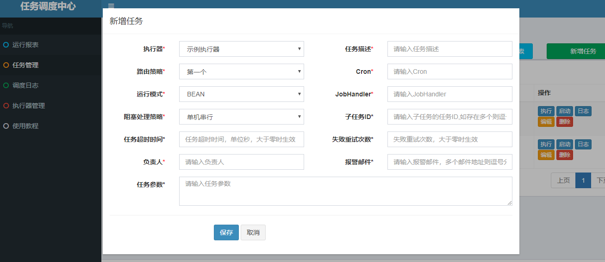

XXL-JOB一个开源的任务调度项目，官方项目地址https://github.com/xuxueli/xxl-job，文档http://www.xuxueli.com/xxl-job

## 简单部署

### 项目导入

先下载项目的zip包解压，把项目文件及pom文件复制到对应项目地方，子pom不用修改，父pom根据需要适当修改

### 数据库

执行doc/db/tables_xxl_job.sql，这里会自己建数据库，也可以自己定义数据库名

### 启动

启动xxl-job-admin下的启动类，浏览器访问地址http://localhost:8080/xxl-job-admin

## 使用

### 添加定时任务

可以参考DemoJobHandler,写一个Handler，继承IJobHandler接口，并添加相应的注解

```java
@JobHandler(value="demoJobHandler")
@Component
public class DemoJobHandler extends IJobHandler {

	@Override
	public ReturnT<String> execute(String param) throws Exception {
		XxlJobLogger.log("XXL-JOB, Hello World.");

		for (int i = 0; i < 5; i++) {
			XxlJobLogger.log("beat at:" + i);
			TimeUnit.SECONDS.sleep(2);
		}
		return SUCCESS;
	}

}
```


### 启动

后台启动xxl-job-admin、xxl-job-executor-sample-springboot

### 后台配置

在“任务管理”一栏“新增任务”，添加对应是corn表达式，确定后，点击启动即可启动当前定时任务
