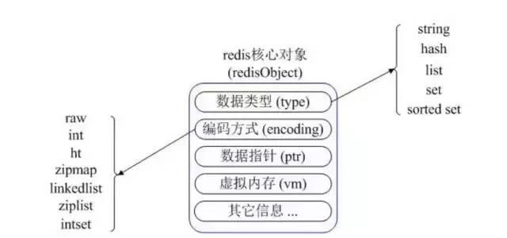

### 基本概念

Redis是C语言开发的一个开源的高性能键值对的内存数据库，可以用作数据库、缓存、消息中间件等。它是一种NoSQL数据库，性能优秀，读写速度非常快，10W QPS，单进程单线程，所以线程安全，采用IO多路复用机制。支持五种数据类型：String、Hash、List、Set、ZSet，支持数据库持久化。可以将内存中数据保存于磁盘中，重启时加载

### 数据类型

Redis内部使用一个redisObject对象来表示所有的key和value。如图



type表示一个value对象的数据类型，encoding是不同数据类型在Redis内部的存储方式

比如：type=String表示value存储的是一个普通字符串，那么encoding可以是raw或int

| 类型             | 简介             | 特性                                                         | 常用命令                         | 场景                         |
| ---------------- | ---------------- | ------------------------------------------------------------ | -------------------------------- | ---------------------------- |
| String           | 二进制安全       | 可以包含任何数据，比如jpg图片或者序列号对象，最大存储512M    |                                  |                              |
| Hash             | 键值对集合       | 适合存储对象，并且可以像数据库中的update一个属性一样只修改某 | hget、hset、hgetall              | 购物车                       |
| List             | 按照插入顺序排序 | 可以添加一个元素到列表的头部或尾部                           | lpush、rpush、lpop、rpop、lrange | 关注列表、粉丝列表、消息队列 |
| Set              | 无序不重复集合   | 通过hashtable实现                                            | sdd、spop、smembers、sunion      | 共同好友                     |
| Zset(Sorted Set) | 有序不重复集合   | 将set中的元素增加一个权重参数score，元素按score进行排序      | zadd、zrange、zrem、zcard        | 排行榜                       |
|                  |                  |                                                              |                                  |                              |

### 用法

Spring boot用法如下

引入依赖

```xml
     <dependency>
            <groupId>org.springframework.boot</groupId>
            <artifactId>spring-boot-starter-data-redis</artifactId>
        </dependency>
        <dependency>
            <groupId>redis.clients</groupId>
            <artifactId>jedis</artifactId>
            <version>2.7.2</version>
        </dependency>
```

配置文件

```yml
  redis:
    database: 0
    host: 40.73.65.243
    port: 6379
    password: adminjic123456
    jedis:
      pool:
        max-active: 20
        max-idle: 10
        min-idle: 8
        max-wait: 3000
    timeout: 2000
  cloud:
    nacos:
      discovery:
        server-addr: localhost:80
```

配置Config

```java
@Configuration
public class RedisConfig {

    @Value("${spring.redis.database}")
    private int databaseIndex;
    @Value("${spring.redis.password}")
    private String password;
    @Value("${spring.redis.host}")
    private String masterHost;
    @Value("${spring.redis.port}")
    private int masterPort;
    @Value("${spring.redis.jedis.pool.max-active}")
    private int maxTotal;
    @Value("${spring.redis.jedis.pool.max-idle}")
    private int maxIdle;

    @Bean
    public JedisPoolConfig createJedisPoolConfig() {
        JedisPoolConfig config = new JedisPoolConfig();
        config.setMaxTotal(maxTotal);
        config.setMaxIdle(maxIdle);
        config.setMaxWaitMillis(-1);
        config.setTestOnBorrow(true);
        config.setTestOnReturn(true);
        return config;
    }

    @Bean
    public JedisShardInfo createJedisShardInfo() {
        String url = String.format("http://%s:%s/%s", masterHost, masterPort, databaseIndex);
        JedisShardInfo info = new JedisShardInfo(url);
        info.setPassword(password);
        return info;
    }

    @Bean
    public ShardedJedisPool createShardedJedisPool(JedisPoolConfig config, JedisShardInfo info) {
        ShardedJedisPool pool = new ShardedJedisPool(config, Arrays.asList(info));
        return pool;
    }

    @Bean
    public RedisDataSource createRedisDataSource(ShardedJedisPool pool) {
        return new RedisDataSourceImpl(pool);
    }

    @Bean
    public RedisClientTemplate createRedisClientTemplate(RedisDataSource dataSource) {
        return new RedisClientTemplate(dataSource);
    }

}
```

### 雪崩、穿透、击穿

#### 雪崩

缓存大面积失效，例如电商首页热点数据缓存时间为12小时，则12小时后改缓存全部失效，如果此时大量用户涌入，则会造成大量请求全部落到数据库

处理方式：

​	1）、在批量往Redis存储数据时，把每个key的失效时间加上随机值，这样可保证数据不会在同一时刻失效

​	2）、Redis集群部署，将热点数据均匀分布在不同的Redis库中，避免全部失效

​	3）、设置热点数据永不过期，有更新操作就更新

#### 穿透

缓存穿透是指缓存和数据库中都没有数据，如果用户（黑客）不断请求，则会频繁查询数据库，比如我们的数据库id都是设置从1自增的，如果收到大量id特别大的请求根本不存在的数据，不断攻击下，数据库会被击垮

处理方式：

​	1）、接口层增加校验，用户鉴权，参数校验

​	2）、使用布隆过滤器，原理是利用高效的数据结构和算法，布隆过滤器可以判断一个值是否存在于集合中，如果返回结果是0则一定不存在于集合，如果返回结果是1则有可能存在于集合，所有我们可以在Redis和数据库中间加一个布隆过滤器，把数据库的某一字段如id预先存入集合中，然后通过这种机制去把缓存穿透控制在一定范围内

#### 击穿

击穿是指一个key非常热点，在不停地抗着大量的请求，大量并发对着一个点，当这个key在失效的瞬间，持续的大量并发直接落到数据库上

​	1）、设置数据永不过期

​	2）、加上互斥锁，锁的是什么呢，锁的是查数据库，在查数据库之前加锁，返回结果后释放锁，这样保证数据库不会被高并发击垮

### 淘汰策略

| 类型            | 说明                                                 |
| --------------- | ---------------------------------------------------- |
| volatile-lru    | 从已设置过期时间的数据集中挑选最近最少使用的数据淘汰 |
| volatile-ttl    | 从已设置过期时间的数据集中挑选将要过期的数据淘汰     |
| volatile-random | 从已设置过期时间的数据集中任意选择数据淘汰           |
| allkeys-lru     | 从数据集中挑选最近最少使用的数据淘汰                 |
| allkeys-random  | 从数据集中任意选择数据淘汰                           |
| no-enviction    | 禁止驱逐数据，若超过最大内存，报错                   |

### 持久化

| 类型 | 说明                                                         | 优点                                                         | 缺点                           |
| ---- | ------------------------------------------------------------ | ------------------------------------------------------------ | ------------------------------ |
| RDB  | 当Redis需要持久化时，会fork一个子进程，子进程将数据写到磁盘上一个临时的RDB文件中，当子进程完成临时文件后，将原来的RDB替换掉 | 这种文件非常适合用于备份：比如，你可以在最近的24小时内，每小时备份一次，并且在每个月的每一天也备份一个RDB文件， | 在服务故障时可能会丢失数据     |
| AOF  | 每一个写命令都通过write函数追加到appendonly.aof中，配置方式有：appendfsyncyesappendfsync always #每次有数据修改发生时都会写入AOF文件。appendfsync everysec #每秒钟同步一次，该策略为AOF的缺省策略。 | AOF可以做到全程持久化，即便AOF的默认策略是每秒钟一次，就算发生故障，也只会丢失一秒钟的数据 | AOF的文件比RDB大很多，速度慢些 |

根据具体情况选择使用哪种，当然Redis支持两种同时开启，

### 主从复制

Redis单节点存在单点故障问题，为了解决单点问题，一般都需要对Redis配置从节点，然后使用哨兵来监听主节点的存活状态，如果主节点挂掉，从节点能继续提供缓存功能

##### 哨兵

一旦主节点宕机，从节点晋升为主节点，同时需要修改应用方的主节点地址，还需要命令所有从节点去复制新的主节点，整个过程需要人工干预。主节点的写能力受到单机的限制。主节点的存储能力受到单机的限制。原生复制的弊端在早期的版本中也会比较突出，比如：Redis 复制中断后，从节点会发起 psync。此时如果同步不成功，则会进行全量同步，主库执行全量备份的同时，可能会造成毫秒或秒级的卡顿。

监控：不断检查主服务器和从服务器是否正常运行。通知：当被监控的某个 Redis 服务器出现问题，Sentinel 通过 API 脚本向管理员或者其他应用程序发出通知。自动故障转移：当主节点不能正常工作时，Sentinel 会开始一次自动的故障转移操作，它会将与失效主节点是主从关系的其中一个从节点升级为新的主节点，并且将其他的从节点指向新的主节点，这样人工干预就可以免了。配置提供者：在 Redis Sentinel 模式下，客户端应用在初始化时连接的是 Sentinel 节点集合，从中获取主节点的信息

### 缓存一致性方案

这里的缓存一致性，指的是最终一致性，缓存一致性方案很多种，我们设计系统应该在尽量不复杂的基础上去保证，针对不同业务场景选择不同方案

#### 设置缓存失效时间

此方案超级简单，应用的场景是业务允许一定时间的数据不一致

#### 先删除缓存再更新数据库

适合大多数场景，但是在并发量很高的情况会出现问题，比如写请求A删除了缓存但是还未更新数据，读请求B进来了，读请求发现缓存无数据会去数据库查询到旧值，并更新缓存，这时候写请求A才更新数据库，此时就会出现缓存是脏数据

#### 延迟双删策略

在上一中方案的基础上，更新数据库后延迟一定的时间（时间为略大于读请求B的时间），再次删除缓存，这样就使得最终的数据是正确的，但是这样有一个缺陷就是加长了请求的时间，降低了系统吞吐量，所以，可以把第二次删除作异步处理

#### binlog方案

binlog是mysql对数据更新的日志，通过订阅解析日志，从而去更新缓存

