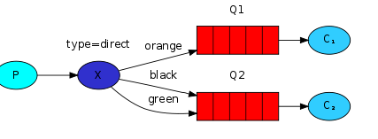

## 应用场景

### 应用解耦

### 流量削峰

比如秒杀系统，在短时间内访问压力骤增，此时有两种处理方式：

1.上游队列缓冲，限速发送

2.下游队列缓冲，限速执行

常见的场景是采用第二种方式，不影响客户使用的相应速度和使用体验

### 异步处理

### 分布式事务

基本原理：保证最终一次性（AP）

比如有两个系统，订单和库存

订单

## 六种工作模式

### 1、simple简单模式

生产者产生消息放入队列，消费者监听消息队列，如果队列中有消息，消息被拿走后，自动从队列中移除（隐患：消息可能未被消费者正确处理就被删除了），应用场景：聊天

### 2、work工作模式

消息生产者将消息放入队列消费者可以有多个，消费者1、消费者2，同时监听同一个队列，C1、C2同时争抢消息，谁先拿到谁负责消费（隐患：高并发场景下，会产生某一个消息被多个消费者共同使用，可以设置一个开关syncronize，保证一条消息只能被一个消费者使用），场景：红包

### 3、publish/subscrible发布订阅模式

X代表交换机，是rabbitMQ的内部组件，生成者将消息放入交换机，交换机发布订阅把所有消息放入所有队列中，对应的消费者都拿到消息消费，场景：群聊天，广播

### 4、routing路由模式

消息生产者将消息发送给交换机按照路由判断，交换机根据路由进行放入队列，最终对应的消费者才能消费

### 5、topic主题模式（路由模式的一种）

星号井号代表通配符，也就是说路由可以模糊匹配

### 6、RPC

## 事务+Confirm

### 事务机制

RabbitMQ中与事务机制有关的方法有三个：txSelect()、txCommit()、txRollback()，toSelect用于将当前channel设置成transaction模式，toCommit用于提交事务，toRollback用于回滚事务

### Confirm模式

采用事务模式会降低RabbitMQ的吞吐量，Confirm模式是有效解决此问题的

生产者将channel设置成confirm模式，所有在该信道上发布的消息都会被指派一个位于的ID，一旦消息被投递到所匹配的队列后，broker就会发送一个确认给生产者（包含消息的唯一ID），这就使得生产者知道消息已经正确到达目的队列了，如果消息和队列是可持久化的，那么确认消息会将消息写入磁盘之后发出，broker回传给生产者的确认消息中deliver-tag域包含了确认消息的序号，此外broker也可以设置成basic.ask的multiple域，表示到这个消息之前的所有消息都得到了处理

confirm模式的最大好处在于它是异步的，一旦发布一条消息，生产者应用程序就可以在等信道返回确认的同事发送下一条消息，当消息得到最终确认后，生产者应用便可以通过回调方法来处理该确认消息，如果RabbitMQ因为自身内部错误导致消息丢失，就会发送一条nack信息，生产者应用程序同样可以在回调方法中处理该nack信息

#### 开启confirm模式

生产者通过调用channel的confirmSelect()方法将channel设置成confirm模式，如果没有设置no-wait标志的话，broker就会返回comfirm.select-ok表示同意(从目前RabbitMQ最新版本3.6来看，如果调用了channel.confirmSelect方法，默认情况下是直接将no-wait设置成false的，也就是默认情况下broker是必须回传confirm.select-ok的)。 

#### 消息确认

为了保证消息从队列可靠地到达消费者，RabbitMQ提供消息确认机制，消费者在声明队列时，可指定noAck参数，当noAck=false时，RabbitMQ会等待消费者显示发回ack信号后才从内存中移除消息，否则，RabbitMQ会在队列中消息被消费后立即删除它

当noAck=false时，对于RabbitMQ而言，队列中的消息分为了两部分：一部分是等待投递给消费者的消息，一部分是已经投递给消费者，但是还么有收到ack信号的消息。如果服务端一直没有收到ack信号，并且消费此消息的消费者已经断开连接，则服务器端会安排该消息重新更新进入队列，等待投递给下一个消费者（也可能是原来那个消费者）

### 其它问题

#### 1、消息基于什么传输，这样做的优点？

Channel信道

信道是生产者和消费者与rabbit通信的渠道，信道是建立在TCP连接上的虚拟连接，rabbitMQ在一条TCP上建立成百上千个信道来达到多个线程处理，这个TCP被多个线程共享，每个线程对应一个信道，信道在rabbit上都有唯一的ID，保证了信道的私有性

疑问：为什么不创建多个TCP连接呢，原因是rabbit保证性能，系统每个线程去开辟一个TCP是非常消耗性能的，每秒成百上千的建立销毁TCP会严重销耗系统性能

类似概念：TCP是电缆，信道是里面的光纤，每个光纤是独立的，互不影响

#### 2、exchange交换机和绑定routing key

exchange的作用类似路由器，routing key类似路由键，服务器会根据路由键将消息从交换机路由到队列上去

exchange的种类：direct、fanout、topic、header。前三种类似集合关系那样：direct(1:1)、fanout(1:N)、topic(N:1)

### 分布式事务

利用rabbitMQ的confirm模式及消息确认机制可以处理分布式事务，

举例说明：订单系统和库存系统

​	首先，订单系统表设计：一张业务表，一张消息表（用于重试），库存系统表设计：一张业务表，一张消息表（用于幂等）

​	一笔请求进来后，首先在订单系统的消息表中插入一条数据未发送，然后向rabbitMQ发送该条消息，然后处理业务，监听rabbitMQ到回执后，更新消息的状态为已发送。对于库存系统，首先收到消息后，去表里面判断重复，如果已经处理直接返回noAck=ture，如果未处理，首先插入消息表并设置状态为待处理，然后处理库存扣减业务，然后更新消息表状态为已处理，并向rabbitMQ发送noAck=true