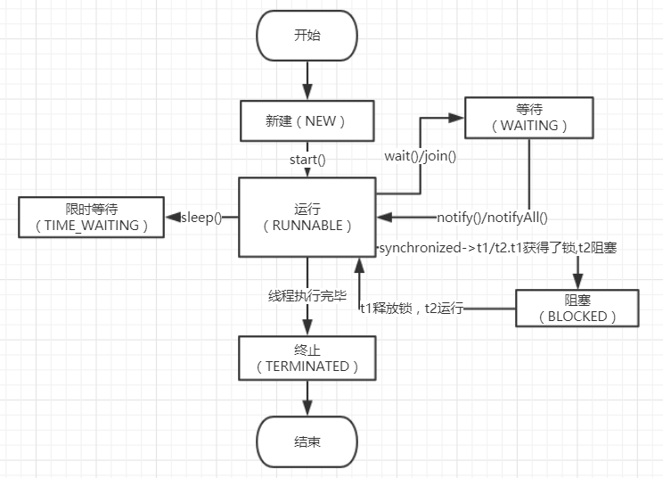
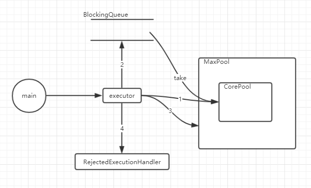

# 基础

## JDK

### 反射

```java
//获取Class对象方式
        System.out.println("======================= student.getClass()方式获取 =======================");
        Student student = new Student();
        Class<?> clazz1 = student.getClass();
        System.out.println(clazz1);
        System.out.println("======================= Student.class方式获取 ============================");
        Class<?> clazz2 = Student.class;
        System.out.println(clazz2);
        System.out.println("======================= Class.forName()方式获取 ==========================");
        Class<?> clazz3 = Class.forName("com.yhj.study.jdk.reflect.Student");
        System.out.println(clazz3);

        //获取Class构造器
        System.out.println("======================= 获取所有公有构造器 ==========================");
        Constructor<?>[] constructors1 =  clazz1.getConstructors();
        for(Constructor constructor : constructors1){
            System.out.println(constructor);
        }
        System.out.println("======================= 获取所有构造器 ==========================");
        Constructor<?>[] constructors2 = clazz1.getDeclaredConstructors();
        for(Constructor constructor : constructors2){
            System.out.println(constructor);
        }
        System.out.println("======================= 获取公有 & 无参构造器 ==========================");
        Constructor constructor1 = clazz1.getConstructor(null);
        System.out.println(constructor1);
        System.out.println("======================= 获取公有 & 有参构造器 ==========================");
        Constructor constructor2 = clazz1.getConstructor(String.class, int.class);
        System.out.println(constructor2);

        //获取Class字段
        System.out.println("======================= 获取所有公有字段 ==========================");
        Field[] fields1 = clazz1.getFields();
        for(Field field :fields1){
            System.out.println(field);
        }
        System.out.println("======================= 获取所有字段 ==========================");
        Field[] fields2 = clazz1.getDeclaredFields();
        for(Field field :fields2){
            System.out.println(field);
        }
        System.out.println("======================= 获取指定字段（公有） ==========================");
        Field nameField = clazz1.getField("name");
        System.out.println(nameField);
        System.out.println("======================= 获取指定字段（私有） ==========================");
        Field ageField = clazz1.getDeclaredField("age");
        System.out.println(ageField);

        System.out.println("======================= 获取一个公有构造器并实例化 =====================");
        Object obj = clazz1.getConstructor().newInstance();
        System.out.println(obj);
        System.out.println("======================= 给实例化对象直接赋值 =====================");
        nameField.set(obj, "张三");
        ageField.setAccessible(true);//强制访问
        ageField.set(obj, 18);
        System.out.println(obj);

        //获取Class方法
        System.out.println("======================= 获取所有公有方法 ==========================");
        Method[] methods1 = clazz1.getMethods();
        for(Method method : methods1){
            System.out.println(method);
        }
        System.out.println("======================= 获取所有方法 ==========================");
        Method[] methods2 = clazz1.getDeclaredMethods();
        for(Method method : methods2){
            System.out.println(method);
        }
        System.out.println("======================= 获取指定公有方法 ==========================");
        Method learningMethod1 = clazz1.getMethod("learning",String.class);
        System.out.println(learningMethod1);
        System.out.println("======================= 调用指定公有方法 ==========================");
        learningMethod1.invoke(obj, "反射知识");
        System.out.println("======================= 获取指定私有方法 ==========================");
        Method learningMethod2 = clazz1.getDeclaredMethod("think", String.class);
        learningMethod2.setAccessible(true);//强制访问
        Object ret = learningMethod2.invoke(obj, "如何攻克地心引力");
        System.out.println(ret);
```


### Integer

```java
/**
 * 实现swap()方法，使得a、b值互换
 * 考察点：反射、自动装箱、缓存范围
 */
public class IntegerDemo {

    public static void main(String[] args) throws Exception {
        Integer a = 1,b = 2;//Integer a = 1 相当于 Integer a = Integer.valueOf(1)
        System.out.println("before:a:" + a + "b:" + b);
        swap1(a, b);
        System.out.println("after:a:" + a + "b:" + b);
    }

    private static void swap1(Integer i1, Integer i2) throws Exception {
        //用反射拿到属性
        Field field = Integer.class.getDeclaredField("value");
        field.setAccessible(true);
        //写法1
        int temp = i1.intValue();
        field.setInt(i1, i2.intValue());
        Integer t = Integer.valueOf(temp);//模拟装箱操作，这里t会变成2，因为在-128~127之前有缓存，装箱后值等于i1.value()=2
        field.setInt(i2, temp);//注意这里用的setInt，这样就避免了int类型的temp被自动装箱，不然装箱后temp传入的值是2

        //写法2
//        Integer temp = new Integer(i1.intValue());
//        field.set(i1, i2.intValue());
//        field.set(i2, temp);//temp是一个新对象，这样写
    }
}

```

### String

```java
        String a = "123";//常量池（在堆中）存储"123"，变量a指向
        String b = "123";//因为常量池中有"123"了，b就会直接指向
        String c = new String("123");//new操作会在堆中创建一个新对象
        System.out.println(a==b);
        System.out.println(b==c);
```

输出结果为true和false

### List和Set

List有序可重复、Set无序不可重复

ArrayList由可变数组实现，初始容量10，扩容因子1.5

LinkedList由链表实现

HashSet由HashMap实现，所以它的特性也和HashMap类似，无序不重复，线程不安全

TreeSet有TreeMap实现

### HashMap

HashMap是一种数组加链表的数据结构，数组的初始容量为16，扩容因子为0.75，每次扩容后数组大小X2，并且一定是2的幂次方倍

当HashMap插入一条数据时，对Key计算hashCode，然后与当前的容量-1进行做&运算，其结果就是当前这条数据需要放入的数组下标，那么，不可避免的是，一定会出现运算结果相同的情况（注意不一定是HashCode相同，如果是Key完全相同就替换），那么同一个数组下标的元素会以链表的数据结构存储，以next指向下一个元素，如果链表的长度大于8，在jdk1.8以后，会转化成红黑树

红黑树

红黑是一种数据结构，要了解红黑树，我们需要先了解二叉树 -> 二叉查找树 -> 二叉平衡查找树，那么红黑树就是一种接近平衡的二叉查找树，这样做是问了提供查询性能，具有五个特性：

每个节点非红即黑

根节点一定是黑

红节点的子节点一定是黑

每个叶子节点是空的黑色节点

从一个节点到该节点的子孙节点所包含的黑色节点数目相同

HashMap中，有新的元素插入红黑树的时候，不管怎样，都需要满足其特性，它根据旋转算法去实现，分为左旋和右旋


扩容

当超过扩容因子0.75的时候，会进行扩容，创建一个新的大小X2的数组，然后把原来的元素进行一一复制到新的数组中，在新的数组中会重新计算HashCode&(数组大小-1)的值，然后决定放入具体哪个位置

### ConcurrentHashMap

线程安全的HashMap，和HashMap数据结构，红黑树，扩容都有类似之处，不同的实现如下：

size大小的计算：

ConcurrenctHashMap对于size这里有优化，因为是在并发的环境下，如果使用一个volitile修饰的size来实现，虽然线程安全可以保证，但是效率低下，为了解决此问题Doug Lea采用了一种以空间换时间的思想，把size按cpu核心数来分成多个，以一个CounterCell数组保存，比如是4核CPU，则是一个大小为4的数组对象来保存size的，这样并发环境下，系统会根据规则加在某一个数组元素之中，这样就提高了效率，最终在计算size()的时候，只需要把他们相加即可

扩容的优化：

ConcurrentHashMap对于扩容这块也做了相应的优化，主要体现在两个地方

一、元素的分批迁移，多线程环境下，当线程A发生扩容的时候，会记录一个状态，线程B添加元素时，如果此时正在进行扩容，则会一起帮助迁移，因为此时数组根据当前的长度把它划分成了若干个片区，如果有新的线程加入，则会执行对应的片区迁移，直到所有片区全部迁移完成，则扩容完成，这也是一个空间换时间的思想

二、链表或红黑树迁移时的优化，常规操作下，元素迁移时，会一个个地计算HashCode值，然后与数组长度-1进行&运算，从而得到新的数组下标，但这里做了一个优化，首先把同一个链表底下的元素进行分类，分为高位类和低位类，怎么分的呢，用HashCode&（数组长度-1）的结果，如果第一位为1则是高位类，为0是低位类，然后把所有的高位元素的数组下标+原来的数组长度得到新的数组下标，而低位类的数组下标保持不变，如此一来就不用逐个去计算和挪动了，大大提高效率

1、ConcurrentHashMap1.8中是基于什么机制来保证线程安全性的？

​		put操作时，通过自旋保证最终成功，采用CAS方式插入头结点（数组上的那个节点），用synchronized锁住头节点来保证插入链表(或红黑树)的节点线程安全

​		remove操作时也是同理，通过自旋保证最终成功，采用CAS方式删除头节点，用synchronized锁住头节点来保证删除链表的节点是线程安全的

2、ConcurrentHashMap通过get方法获取数据的时候，是否需要通过加锁来保证数据的可见性？为什么？

​		Node中val和next是用volatile修饰的，那么在添加的时候是对其它线程可见的，所以不需要加锁保证

3、ConcurrentHashMap1.7和ConcurrentHashMap1.8有哪些区别？

​		取消了segment分段设计，直接采用node数组来保存数据，这样降低了粒度，使得效率更高

​		引入红黑树数据结构

4、ConcurrentHashMap1.8为什么要引入红黑树？

​		对于链表长度大于8，数组大小扩容到64时，会将链表修改成红黑树，对于数据量大的情况，查询效率提升明显

### 克隆

浅克隆：基本类型和String会复制，引用类型指向地址，实现方式：类实现clone接口

深克隆：基本类型和String会复制，引用类型复制，实现方式：转化为字节流输出后再转化回来(序列化和反序列化)，或者重写clone()方法把引用属性都new一遍

### 受检异常和非受检异常

java.lang.Throwable

- Error
- Exception
  - RuntimeException(非受检异常，可以不处理)
  - 其它，如IOException、SQLException(受检异常，必须处理，不然编译报错)

PS:我们在设计自定义异常的时候，一般设计成非受检异常，保证代码美观，但是一旦此异常影响了系统的稳定性，就设计成受检异常

### 乐观锁和悲观锁

乐观锁：CAS替换，用version做版本控制

悲观锁：synchronized，select * from table for update

### BIO、NIO、AIO


## 多线程

### 线程的6种状态



### synchronized

java中用于处理并发情况下的一个关键字，synchronized所包含的代码块，当多线程并发时候，会依次执行，从而保证线程的安全性

原理：首先讲一下java对象在内存中如何保存，它分为对象头(包含Mark Word)、实例数据、填充数据，其中Mark Word中包含了与锁相关的信息，如果是32位jvm则是32位，64位jvm则是64位

这里的锁状态分为如下几种：无锁、偏向锁、轻量级锁、重量级锁，他们的性能依次递减

随着锁竞争的激烈程度，锁会逐渐升级，

锁升级：一开始是无锁状态，当现场A开始访问时，由无锁升级成偏向锁，对象头中存储A的线程id，线程B访问时，会用线程B的id和锁中存储的id进行CAS替换，替换成功，则把Mark Word中线程ID设置成线程B，此时是线程B的偏向锁，如果替换失败，锁升级为轻量级锁，Mark Word存储指向锁记录的指针，次数>10次，升级成重量级锁（这个10次数也可以设置成自适应自旋，因为jvm考虑到CAS了10次所消耗的资源与启动重量级锁消耗资源更高），所以才会升级成重量级锁，重量级锁依赖对象内部的monitor锁，而monitor锁是依赖底层的MuteLock(互斥锁)来实现的，重量级锁会阻塞其他线程，避免其他线程自旋消耗性能

### Volatile

volatile修饰属性用于保证其可见性

并发编程中的三大性质可见性、有序性、原子性：

可见性：一个线程对变量的修改，立即对另一个线程可见

有序性：程序按顺序执行（编译器在编译的时候不一定会按我们写好的去顺序执行，它有一个重排序优化过程）

原子性：一个操作不可中断，要么成功要么失败

volitile修饰可以保证可见性，一定程度上保证有序性，因为volatle修饰的属性，编译器不会进行重排序的（Happen-Before原则之一），而synchronized显然是一种原子性的保障，所以我们用synchronized和volatile组合使用可以保证线程安全

四种内存屏障：

LoadLoad:

StoreStore:

LoadStore:

StoreLoad:

volatile原理：

JMM(java内存模型)

JMM和物理上的缓存和多核CPU之间的模型类似，JMM定义了线程和主内存之间的抽象关系：线程之间的共享变量存储在主内存中，每个线程都有一个私有的本地内存，本地内存中存储了该线程以读/写共享变量的副本。本地内存是JMM的一个抽象概念，并不真实存在。由于本地内存有主内存的变量的副本，那么就会有这样的问题出现，两个线程之间的副本不一致，从而带来A线程把变量值改了， 而B线程没有立即可见，从而导致线程安全问题

首先会编译成字节码文件，我们可以看到多了一个叫ACC_VOLATILE的标志，这个对应到hotspot虚拟机里面的is_volatile参数，添加内存屏障，从而保证可见性，

### 如何停止一个线程

方式一：stop()方法，此方法已过时，因为是强制停止，所以不建议用

方式二：主线程interrupt()，子线程通过Thread.currentThread().isInterrupted()返回true来确定线程可以被停止

方式三：设置一个共享变量volatile stop，主线程设置stop=true，子线程做判断停止线程

### Thread.join的实现原理

join()方法是用于，等待一个线程执行完，继续执行后面逻辑，比如线程t1、t2，我们可以通过如下代码实现它们的顺序执行

```java
		t1.start();
        t1.join();
        t2.start();
```

join()关键源码如下

```java
 		while (isAlive()) {
        	wait(0);
        }
```

isAlive()是一个native方法，可以知道当前线程t1是否仍在执行，如果在执行，调用wait()阻塞线程（注意阻塞的是主线程，因为t1也是一个Object），有阻塞就有唤醒，那么什么时候唤醒呢，在t1线程执行完毕以后，t1会调用notifyAll()来唤醒主线程，这个过程在JVM底层实现，Java代码里面看不到

### ThreadLocal

本地线程变量，是在每个线程中创建一个副本（这里其实是一个引用副本，所以一般我们会在当前线程new一个对象，比如重写initialValue()方法或者调用set()方法），每个线程可以访问自己内部的变量

如何实现

在Thread.java中有变量ThreadLocal.ThreadLocalMap threadLocals = null，也就是说每一个线程可以拥有一个这样的map，它是在初始化线程变量的时候赋予的，这个map的key就是TreadLocal，value是一个Entry，存储着对应的自定义对象

用途

数据库链接，session，全局模型对象Model

### 线程池

Executors提供的4种线程池

```java
    Executor executorSingle = Executors.newSingleThreadExecutor();//返回一个线程
    Executor executorFixed = Executors.newFixedThreadPool(4);//返回固定数量的线程池
    Executor executorCached = Executors.newCachedThreadPool();//不限制最大线程数量，线程空闲后会被回收
    Executor executorScheduled = Executors.newScheduledThreadPool(4);//延迟执行
```

它们的核心构造器是ThreadPoolExecutor.java，所以了解了ThreadPoolExecutor就是了解了线程池的原理，如图所示



一个任务对应一个worker，核心线程足够的时候，优先使用核心线程执行，如果不够，加入阻塞队列中（用take方法依次执行），如果阻塞队列不够了，则启用最大线程（类似于临时工，这个是可以设置销毁的时间的），如果还不够，则执行RejectedExecutionHandler拒绝策略，这个需要开发自行去实现代码，对应到图中1、2、3、4步骤
如何合理配置线程池的参数
主要说下核心线程池的数量，首先分析当前任务的性质，是属于CPU密集型，还是IO密集型，
CPU密集型：每次任务时间短、任务量大
IO密集型：每次任务时间长、任务量一般
CPU密集型一般配置的CPU数量+1个核心线程

### J.U.C

### AQS


## JVM

### 内存布局

### 有哪些GC

### CMS和G1

### 调优

### GCROOT,虚拟机栈可以成为GCROOT的原因

### ClassLoader有几种，通过一段代码打印出几种ClassLoader


### 强引用、软引用、弱引用、虚引用

强引用：平时最常用的，在内存不足的情况GC也不会回收，抛出OOM

软引用SoftReference：在内存不足情况下被回收，避免OOM

弱引用WeakReference：有GC执行时会被回收

虚引用PhantomReference：与ReferenceQueue一起使用，get()的值一直是null

## Mysql

### mysql体系架构

### mysql调优思路

### 为什么mysql的符合索引是遵循最左匹配原则

### 索引的本质是什么，B+树，为什么采用B+树

### mysql优化器工作原理


# 框架

## 设计模式

### 设计模式7大原则

| 原则         | 说明                                                         |
| ------------ | ------------------------------------------------------------ |
| 开闭原则     | 对扩展开发、对修改关闭                                       |
| 依赖倒置原则 | 抽象不应该依赖于细节，细节应该依赖抽象。换言之，要针对接口编程，不是实现编程 |
| 单一职责原则 | 一个类或一个方法干一件事                                     |
| 接口隔离原则 | 使用多个专门的接口，不是使用一个总接口，即客户端不应该依赖那些它不需要的接口 |
| 迪米特法则   | 降低耦合性                                                   |
| 里氏替换原则 | 可以用父类，就可以用子类代替                                 |
| 合成复用原则 | 多组合聚合，少继承                                           |

### 设计模式总结

| 设计模式                | 说明                                           | 举例                                                |
| ----------------------- | ---------------------------------------------- | --------------------------------------------------- |
| 工厂模式（Factory）     | 只对结果负责，封装创建过程                     | BeanFactory、Calender                               |
| 单例模式（Singleton）   | 保证独一无二                                   | ApplicationContext、Calender                        |
| 原型模式（Prototype）   | 拔一根猴毛，吹出千万个                         | ArrayList、PrototypeBean                            |
| 代理模式（Proxy）       | 找人办事，增强职责                             | ProxyFactoryBean、JdkDynamicAopProxy、CglibAopProxy |
| 委派模式（Delegate）    | 干活算你的（普通员工），功劳算我的（项目经理） | DispatcherServlet、BeanDefinitionParserDelegate     |
| 策略模式（Strategy）    | 用户选择、结果统一                             | InstantiationStrategy                               |
| 模板模式（Template）    | 流程标准化，实现自己定制                       | JdbcTemplate、HttpServlet                           |
| 适配器模式（Adapter）   | 兼容转换头                                     | AdvisorAdapter、HandlerAdapter                      |
| 装饰器模式（Decorator） | 包装、同宗同源                                 | BufferedReader、InputStream、OutputStream           |
| 观察者模式（Observer）  | 任务完成时通知                                 | ContextLoaderListener                               |
| 责任链模式              |                                                |                                                     |

### 工厂模式有几种，区别是啥

简单工厂、工厂方法、抽象工厂

### 单例模式常见写法

饿汉式

```java
    private static final HungryStaticSingleton hungryStaticSingleton;

    static {
        hungryStaticSingleton = new HungryStaticSingleton();
    }

    private HungryStaticSingleton(){

    }

    public static HungryStaticSingleton getInstance(){
        return hungryStaticSingleton;
    }
```


懒汉式

双重检查锁式懒汉

```java
   private static LazyDoubleCheckSingleton lazy = null;

    private LazyDoubleCheckSingleton(){

    }

    //双重检查锁
    public static LazyDoubleCheckSingleton getInstance(){
        if(lazy == null){
            synchronized (LazyDoubleCheckSingleton.class){
                if(lazy == null){
                    lazy = new LazyDoubleCheckSingleton();
                }
            }
        }
        return lazy;
    }
```

内部类式懒汉

```java
    //虽然构造方法私有了，但是逃不过反射的法眼
    private LazyInnerClassSingleton (){
        if(LazyHolder.LAZY != null){
            throw new RuntimeException("不允许构建多个实例");
        }
    }

    //懒汉式单例
    //LazyHolder 里面的逻辑需要等到外部调用时才执行
    //巧妙地运用了内部类的特性
    //JVM底层执行逻辑，完美地避免了线程安全问题
    public static  final LazyInnerClassSingleton getInstance(){
        return LazyHolder.LAZY;
    }

    private static class LazyHolder{
        private static final LazyInnerClassSingleton LAZY = new LazyInnerClassSingleton();
    }
```


破坏单例模式的方法

```
1.多线程，如果懒汉式单例是线程不安全的可以通过此方式破坏
2.反射，通过反射调用实例化方法
3.序列化，序列化之后再通过反射调用构造器进行创建实例
```

### 代理模式

代理模式分为静态代理和动态代理，动态代理有Jdk代理和Cglib代理，

jdk动态代理原理是在编译时生成了一个新的字节码文件$Proxy0.class，它是通过用代码写代码的方式写了一个新的类，然后自己编译的

```java
public class JDKMeipo implements InvocationHandler {

    private Person person;

    public Object getInstance(Person person)throws Exception{
        this.person = person;
        Class<?> clazz = person.getClass();
//        Person.class.getClassLoader();
        return Proxy.newProxyInstance(Person.class.getClassLoader(),clazz.getInterfaces(),this);
    }

    @Override
    public Object invoke(Object proxy, Method method, Object[] args) throws Throwable {
        before();
        Object obj = method.invoke(this.person, args);
        after();
        return obj;
    }

    //功能增强
    private void before(){
        System.out.println("我是媒婆，我要给你找对象");
        System.out.println("开始验货");
    }

    private void after(){
        System.out.println("OK");
    }

}
```


### 模板模式除了继承外，还有哪些实现方式？

答：还可以聚合


## Spring

### OOP、BOP、IOC、DI、AOP

OOP：面向对象编程，把业务需求转化成代码的过程

BOP：面向Bean的编程，管理Bean，由此Spring的IOC就是干这个事情

IOC：控制反转，控制的是JavaBean，反转给谁，把Bean的实例化交给BeanFactory管理，IOC实现具体分为三大步：定位、加载、注册，定位是定位相关配置文件的位置，有的是用xml文件定义的，有的是用注解定义的，把它们用BeanDefinitionReader做统一定义，用BeanDefinitionReader加载所有的类到List<BeanDefinition>，然后把这个集合放到一个map对象里面Map<String, BeanDefinition> beanDefinitionMap，这是一个伪IOC容器，然后把Bean实例化，取决于bean是否需要延迟加载lazyInit=true表示延迟加载，否则是容器启动的时候就加载，singleton=true表示单例，只能有一个对象，否则可以定义相应的beanName来实例化多个

DI：依赖注入，用反射将需要注入的属性赋值的过程，DI主要分为两步：实例化、依赖注入，调用getBean方法会实例化，或者有的Bean是在容器启动的时候实例化，依赖注入这块主要是针对属性而言的，通过反射依次注入相关属性，如果当时没有对应的属性实例，则记录下来等待下一次轮询，这样可以解决循环依赖的问题

AOP：既然BOP是面向Bean的编程，那么AOP就是面向切面的编程，通过规则（包路径+表达式）定义需要面向的范围，然后定义前置、后置、异常等处理，过程分三步：创建代理对象、调用具体方法、触发通知，AOP是生成一个新的代理类，当然肯定是在初始化Bean的时候开始的，也就是initializeBean()方法，根据类特征创建相应的代理对象，默认用JDK代理，如果是接口的（JDK代理搞不定的）用Cglib代理，调用具体方法的时候，调用的是Proxy的invoke()方法，最终触发对应的每一个通知的invoke()方法


### Spring中核心的模块有哪些

spring-core：	核心

spring-beans：beans管理，如BeanFactory、FactoryBean

spring-context：各种容器，ApplicationContext

spring-aop：切面模块

spring-jdbc：链接数据库，如JdbcTemplate

spring-orm：关系映射模块，jpa和hibernate5

spring-webmvc：MVC框架，DispatcherServlet

spring-test：测试模块

spring-expression：异常模块

### BeanFactory和FactoryBean

BeanFactory是一个工厂类，IOC容器，所有被管理的Bean从这里获得，比如ApplicationContext，而FactoryBean看命名就知道是一种Bean，实现了这个接口的Bean不是一个普通的Bean，它也可以被BeanFactory管理，但是获得的对象并不是Bean本身，而是一个泛型Object，实例化这个Object是通过重写getObject()方法做到的，如果需要返回容器本身，则需要在BeanFactory的getBean(name)参数中加入前缀"&"符号。比如ProxyFactoryBean、JndiObjectFactoryBean

### Spring有哪些设计模式，举例说明

工厂模式：BeanFactory

单例和原型：创建Bean的时候

模板+钩子方法：DispatcherServlet的initStrategies()方法，它初始化了SpringMVC的9大组件

委派模式：以Strategy结尾

策略模式：以Resolver结尾，都是策略模式的体现，比如SpringMVC的view视图组件，异常拦截组件

代理：Spring中有两种代理，JDK代理和Cglib代理，在AOP中会根据实际情况选用哪一种

适配器：HandlerAdapter


### SpringMVC的启动和调用过程

启动过程：启动时容器会通过HttpServlet的init()方法调用，由于DispatcherServlet重写了init()方法，所以会被调用，而这个方法中会调用onRefresh()方法，然后会调用initStrategies()方法，初始化9大组件，其中重要的组件有：HandMapping，HandAdapter，视图组件等，HandMapping用于存储Method(反射拿到)、映射URL(注解取到)、对应实例(IOC容器拿到)，HandAdapter是真正的处理类，通过反射的机制去调用HandMapping中的Method方法，参数可以从request和@RequestParam注解中拿到，视图组件处理返回

调用过程：收到请求后，会通过HttpServlet的service()方法调用到DispatcherServlet的service()方法，然后调用到doDispatcher()方法，首先会通过url找到对应的HandMapping，然后找到HandAdapter处理后返回ModelAndView对象，然后通过对应的视图组件将ModelAndView渲染成对应的类型，json或html，返回到前端显示

### Spring事务

ACID原则：原子性、一致性、隔离性、持久性

并发下产生的问题：

脏读：A事务未提交数据，B事务却读到了

不可重复读：A事务读数据，B事务修改数据未提交，A事务再次读到的数据变了，不可重复读强调数据的更新

幻读：A事务读取一片数据，B事务新增一条数据，A事务再次读取时多了一条数据，幻读强调数据新增删除

隔离级别：

| 隔离级别                     | 脏读   | 不可重复读 | 幻读   |
| ---------------------------- | ------ | ---------- | ------ |
| 读未提交（Read-Uncommitted） | 允许   | 允许       | 允许   |
| 不可重复读（Read-Committed） | 不允许 | 允许       | 允许   |
| 可重复读（Repeatable-Read）  | 不允许 | 不允许     | 允许   |
| 串行化（Serializable）       | 不允许 | 不允许     | 不允许 |

SpringJDBC中的传播行为：

| 事务传播行为类型          | 说明                                                         |
| ------------------------- | ------------------------------------------------------------ |
| PROPAGATION_REQUIRED      | 如果当前没有事务，就新建一个事务，如果已经存在一个事务，加入到这个事务 |
| PROPAGATION_SUPPORTS      | 支持当前事务，如果没有当前事务，就以非事务方式执行           |
| PROPAGATION_MANDATORY     | 使用当前的事务，如果当前没有事务，就抛出异常。               |
| PROPAGATION_REQUIRES_NEW  | 新建事务，如果当前存在事务，把当前事务挂起。                 |
| PROPAGATION_NOT_SUPPORTED | 以非事务方式执行操作，如果当前存在事务，就把当前事务挂起。   |
| PROPAGATION_NEVER         | 以非事务方式执行，如果当前存在事务，则抛出异常。             |
| PROPAGATION_NESTED        | 如果当前存在事务，则在嵌套事务内执行。如果当前没有事务，则执行与PROPAGATION_REQUIRED类似的操作。 |


## MyBatis


# 分布式

### TCP/IP四层网络模型

应用层：请求发起

传输层：TCP头+Http请求报文

网络层：IP头+TCP头+Http请求报文，可做三层负载，根据IP来负载

网络接口层：Mac地址+IP头+TCP头+Http请求报文，可做二层负载，根据Mac地址去负载

### TCP三次握手和四次挥手

第一次握手：客户端发送SYN包(seq=x)到服务器，并进入SYN_SEND状态，等待服务器确认

第二次握手：服务器收到SYN包，必须确认客户端ACK(ack=x+1)，同时自己也发送一个syn包(seq=y)，服务器进入SYN_RECV状态

第三次握手：客户端收到服务器的Syn+Ack包，向服务器发送确认包Ack(ack=y+1)，此包发送完毕，客户端和服务器进入ESTABLISHED状态，完成三次握手

第一次挥手：主动关闭方发送一个FIN，用来关闭主动方到被动方的数据传送

第二次挥手：被动关闭方收到FIN包后，发送一个ACK给对方，确认序号为收到序号+1

第三次挥手：被动关闭方发送一个FIN，用来关闭被动关闭方到主动关闭方的数据传送

第四次挥手：主动关闭方收到FIN后，发送一个ACK给被动关闭方，确认序号为收到序号+1，至此，完成四次挥手


### 什么是幂等，如何实现

幂等是同一个业务请求，重复请求时候需要返回相同结果

方式一：利用数据库的唯一索引实现，请求的时候生成一个唯一请求号先插入一条数据，如果重复请求就会报错

方式二：用redis实现，生成一个唯一单号，放入redis，请求的时候先去查redis中是否有数据，有则表示重复请求

### 缓存穿透

正常情况下，一个请求会先去缓存中取数据，如果存在则返回，不存在则查询数据库，当发生大量查询空数据的情况下，会不断地查询数据库，从而导致数据库宕机，这种现象叫缓存穿透

方案一：对于查询为空的数据设置一个虚拟的value值(比如"&&")，放入缓存中，则可避免数据库被再次访问

方案二：在缓存之上加入布隆过滤器，布隆过滤器是一个不精确的Set结构，当布隆过滤器说不存在时一定不存在，存在时可能不存在，这样就会过滤掉大量的空的查询攻击

### Nginx

是一个高性能的反向代理服务器

正向代理代理的是客户端

反向代理代理的是服务端

### 数据库和缓存双写如何保证数据一致性

先操作数据库还是先操作缓存：根据业务场景来

更新缓存还是删除缓存：根据缓存更新是否复杂来

最终一致性：如果更新或删除缓存失败，可以把任务加入到MQ队列中，然后用一个消费端去异步执行保证最终一致性，当然这样的场景是在业务中容忍一定延迟的前提下

### 请设计一个高性能分布式调度框架

# 微服务


